# health-charts.el

Medical and health charts in Emacs from data you supply. health-chart
never fetches anything and never ships reference data: you hand it plain
Lisp data (or JSON), it validates that data strictly, with a reason code
and a JSON path for every failure, and draws it through the
[eas.el](https://github.com/davidawad/eas.el) chart engine. One call
draws any of the 28 templates (vitals, labs, glucose, medication, sleep,
growth, ...) as text in a terminal frame or as an SVG image in a GUI
frame. Pure Elisp; the only external process is the optional PNG export
of the screenshots.

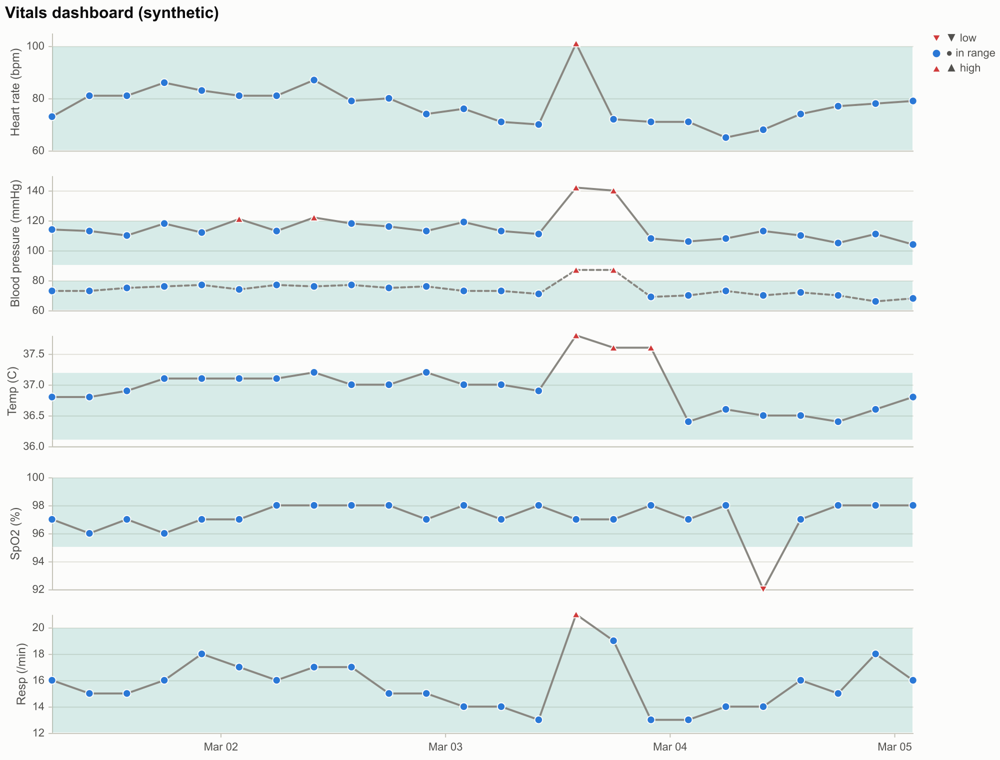

All example data in this repository is synthetic. Reference ranges in the
examples are illustrative and labelled so. **These charts are for
visualisation, not diagnosis or medical advice.**

Requires Emacs 30.1+ and [eas.el](https://github.com/davidawad/eas.el) 0.2.2+.

## Install

Install eas, then this package. On macOS or Linux with Homebrew the eas
command-line tool comes from the tap:

```sh
brew install davidawad/tap/eas
```

For Emacs (30.1 or newer), with `:vc`:

```elisp
(use-package eas
  :vc (:url "https://github.com/davidawad/eas.el" :lisp-dir "src"))
(use-package health-chart
  :vc (:url "https://github.com/davidawad/health-charts.el" :lisp-dir "src"))
```

or add both `src/` directories to `load-path` and `(require 'health-chart)`.

## Use

A chart is a template plus bindings: the data and the few numbers the
template needs (a reference range, a target). Bindings are JSON, or the
same thing as a Lisp plist.

```elisp
(require 'health-chart)

;; the synthetic example bindings of a template, drawn: SVG in a GUI
;; frame, text in a terminal
(health-chart-render "vitals-trend" (health-chart-example "vitals-trend"))

;; your own data
(health-chart-render
 "vitals-trend"
 '(:title "Resting heart rate" :y_title "Heart rate (bpm)" :low 60 :high 100
   :data [(:time "2026-03-01T08:00" :value 72)
          (:time "2026-03-02T08:00" :value 104)
          (:time "2026-03-03T08:00" :value 58)])
 :backend 'text)

;; from JSON, into a live view with hover, crosshair and zoom
(health-chart-open "bp-trend" (health-chart-read-bindings "bp.json"))

;; every template over its example
(health-chart-demo "agp")
```

From the shell, `bin/health-chart` is eas's command line with the health
templates registered (set `EAS` to your eas.el checkout if it is not
beside this repository):

```sh
bin/health-chart templates                                  # the catalog
bin/health-chart example vitals-trend --raw > b.json        # bindings that render as is
bin/health-chart validate vitals-trend --data b.json        # error code and JSON path, exit 1 on failure
bin/health-chart render vitals-trend --data b.json --backend text --raw
bin/health-chart render vitals-trend --data b.json --backend svg --raw > chart.svg
```

`check`, `explain`, `export --vl`, `describe` and `doctor` are eas's own
verbs (see its README); every verb answers the `chart/v1` envelope.

## The data contract

Every template takes **bindings**: an object keyed by the template's slots.
One or more slots are tables, lists of row objects (`data`, and for some
templates `curves`, `panels`, `bands`, `doses`, ...). The rest are scalars
(a title, `low` and `high` for a range, an `as_of` date). `describe`
shows both:

```elisp
(health-chart-describe-template "lab-trend")
;; => (:name "lab-trend" :doc ... :slots ... :tables (:data (:fields (:time "time" :value "number" ...))) ...)
```

Times are ISO 8601 strings (`2026-03-01`, `2026-03-01T08:30`, with an
optional seconds and zone), oldest first. Nothing is read from the
clock: a chart that needs "today" takes an `as_of` slot.

### Validation

Nothing is drawn until the bindings pass. `health-chart-validate` returns
`t` or signals `health-chart-invalid-data` (parent `health-chart-error`);
`health-chart-check` returns `t` or the same facts as a plist. The data
of the error is `(MESSAGE :code CODE :path PATH :index INDEX :field FIELD)`,
and `health-chart-error-data` returns it as a plist. `PATH` is a JSON path
such as `data[3].value`, `INDEX` the offending row and `FIELD` the offending
field. The message says how to fix it.

| Code | Meaning |
|---|---|
| `unknown_template` | no such template; the message lists them |
| `not_an_object`, `slot_unknown`, `missing_slot`, `slot_type` | the bindings as a whole: not an object, a slot the template lacks, a required slot left out, a slot of the wrong type |
| `not_a_list`, `too_few_rows`, `not_a_row` | a table is not a list, is empty, or holds a non-object |
| `missing_field` | a row lacks a required field (`data[0].value`) |
| `not_a_number`, `negative_value`, `not_an_integer`, `out_of_range` | numeric fields: not finite, below zero, not whole, outside 0..100, 0..1 or a declared range |
| `not_a_string`, `not_a_bool`, `not_in_enum` | text, boolean and choice fields |
| `not_a_time`, `not_a_date` | not an ISO 8601 date-time or date (checks the calendar: `2026-02-30` fails) |
| `time_not_ascending` | rows go back in time |
| `range_inverted`, `interval_inverted`, `diastolic_above_systolic`, ... | a low above its high, an end before its start |

## Template catalog

| Template | Group | What it draws |
|---|---|---|
| [`bp-trend`](#bp-trend) | Vitals | Blood pressure over time: each reading is a bar from diastolic to systolic, drawn over the normal systolic and diastolic bands; readings outside either band are flagged by color and shape. |
| [`vitals-dashboard`](#vitals-dashboard) | Vitals | Five vitals on one time axis, each against its normal range: heart rate, blood pressure (systolic and diastolic), temperature, SpO2 and respiratory rate. |
| [`vitals-trend`](#vitals-trend) | Vitals | One vital sign over time against its normal range: the range as a band, readings outside it flagged by color and shape. |
| [`ecg-strip`](#ecg-strip) | Heart and rhythm | An ECG-style strip: millivolts against seconds over ECG paper (small boxes 0.04 s by 0.1 mV, large boxes 0.2 s by 0.5 mV). |
| [`hrv-trend`](#hrv-trend) | Heart and rhythm | Daily heart-rate variability (RMSSD) with a 7-day rolling mean and a personal baseline band; days below the baseline are flagged. |
| [`lab-change`](#lab-change) | Lab results | Before and after for each analyte on its own reference range: a dumbbell from the earlier result (hollow) to the later one (filled). |
| [`lab-panel`](#lab-panel) | Lab results | Small multiples: one compact trend per analyte, each on its own scale with its reference range as a band and out-of-range results flagged by color and shape. |
| [`lab-recency`](#lab-recency) | Lab results | How long ago each test was last drawn, against how often it should be: a bar of days since the last draw and a tick at the recommended interval. |
| [`lab-results`](#lab-results) | Lab results | Latest result of many analytes, each placed within its own reference range: the range is the bar, the result a marker, and results outside the range are flagged by color, shape and the legend. |
| [`lab-status-grid`](#lab-status-grid) | Lab results | A grid of analytes by draw date, each cell colored and marked low, in range or high against that row's own reference range, with the glyph and the value in the cell. |
| [`lab-trend`](#lab-trend) | Lab results | One lab analyte over time against its reference range: the range as a band, an optional optimal band inside it, and results outside the range flagged L or H by color, shape and letter. |
| [`lipid-panel`](#lipid-panel) | Lab results | A lipid panel against goal lines: one bar per measure (total cholesterol, LDL, HDL, triglycerides, non-HDL), a tick at its goal, an optional hollow marker for the prior draw. |
| [`agp`](#agp) | Glucose and diabetes | Ambulatory glucose profile: many days of readings folded onto one 24 hour day as the median line with the 25-75th and 5-95th percentile bands and the target range limits. |
| [`cgm-day`](#cgm-day) | Glucose and diabetes | A continuous glucose monitor day: the glucose line over 24 hours, the target range as a band, very low and very high limits as dashed rules, readings outside the range flagged by colour and shape. |
| [`time-in-range`](#time-in-range) | Glucose and diabetes | Time in range: the share of glucose readings very low, low, in range, high and very high per period (weeks, days, any label you give), computed from the raw readings; the consensus target is over 70 percent in range. |
| [`a1c-trend`](#a1c-trend) | Trends against published categories (A1c, eGFR, BMI) | HbA1c (%) over time against the ADA diagnostic categories (under 5.7 normal, 5.7-6.4 prediabetes, 6.5 and over diabetes), with an optional personal target line. |
| [`egfr-trend`](#egfr-trend) | Trends against published categories (A1c, eGFR, BMI) | Estimated GFR (mL/min/1.73 m2) over time against the KDIGO CKD stage bands G1 to G5. |
| [`weight-bmi-trend`](#weight-bmi-trend) | Trends against published categories (A1c, eGFR, BMI) | BMI over time, computed from weight and height, against the WHO adult categories (under 18.5, 18.5-24.9, 25-29.9, 30 and over); the weight is in the tooltip. |
| [`fluid-balance`](#fluid-balance) | Fluids | Fluid balance per day: intake bars up, output bars down, in millilitres, with the net balance marked and labelled; the totals are computed from the individual entries. |
| [`medication-timeline`](#medication-timeline) | Medication | Medication courses as bars on a timeline, each scheduled dose marked taken, late or missed (shape and colour), with the adherence share per medication. |
| [`immunization-timeline`](#immunization-timeline) | Immunizations | Immunization history: one row per vaccine, doses given as filled points, doses still due as grey diamonds and doses due before the as_of date as red triangles. |
| [`symptom-diary`](#symptom-diary) | Symptoms | Symptom or pain diary: one row per symptom, one column per day, each cell shaded and numbered by the severity logged (0 none to 10 worst); a note rides in the tooltip. |
| [`cycle-tracker`](#cycle-tracker) | Cycle tracking | Menstrual cycle tracker: one row per cycle on a cycle-day axis, phases as labelled coloured segments and optional daily markers. |
| [`growth-chart`](#growth-chart) | Growth | Paediatric growth chart: percentile curves bound by the caller (bind published CDC or WHO curves; this package ships none) with the patient's measurements drawn over them. |
| [`sleep-duration`](#sleep-duration) | Sleep | Nightly sleep as stacked bars by stage, the time in bed in hours above each night and the sleep goal as a dashed line. |
| [`sleep-hypnogram`](#sleep-hypnogram) | Sleep | One night of sleep as a hypnogram: the stage (awake, REM, light, deep) over time, one segment per stage change. |
| [`activity-calendar`](#activity-calendar) | Activity and fitness | A calendar heatmap of a daily count such as steps: weeks as columns, weekdays as rows, color by value, a check mark on days that met the goal. |
| [`hr-zones`](#hr-zones) | Activity and fitness | Time spent in each heart-rate zone as horizontal bars, with the zone's bpm bounds and its share of the total. |

### Vitals

#### bp-trend

Blood pressure over time: each reading is a bar from diastolic to systolic, drawn over the normal systolic and diastolic bands; readings outside either band are flagged by color and shape.

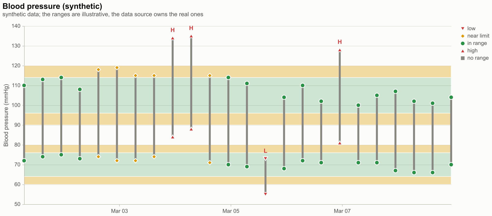

- Takes: `data` as rows `{time, systolic, diastolic}`
- Required slots: `sys_low`, `sys_high`, `dia_low`, `dia_high`
- Try it: `(health-chart-demo "bp-trend")`

#### vitals-dashboard

Five vitals on one time axis, each against its normal range: heart rate, blood pressure (systolic and diastolic), temperature, SpO2 and respiratory rate. Readings outside a range are flagged by color and shape.


- Takes: `data` as rows `{time, metric, value}`
- Required slots: `hr_low`, `hr_high`, `sbp_low`, `sbp_high`, `dbp_low`, `dbp_high`, `temp_low`, `temp_high`, `spo2_low`, `spo2_high`, `rr_low`, `rr_high`
- Try it: `(health-chart-demo "vitals-dashboard")`

#### vitals-trend

One vital sign over time against its normal range: the range as a band, readings outside it flagged by color and shape.

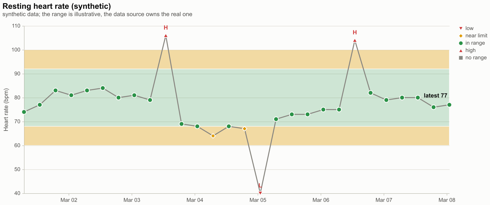

- Takes: `data` as rows `{time, value}`
- Required slots: `low`, `high`
- Try it: `(health-chart-demo "vitals-trend")`

### Heart and rhythm

#### ecg-strip

An ECG-style strip: millivolts against seconds over ECG paper (small boxes 0.04 s by 0.1 mV, large boxes 0.2 s by 0.5 mV). A drawing aid, not a diagnostic tool.

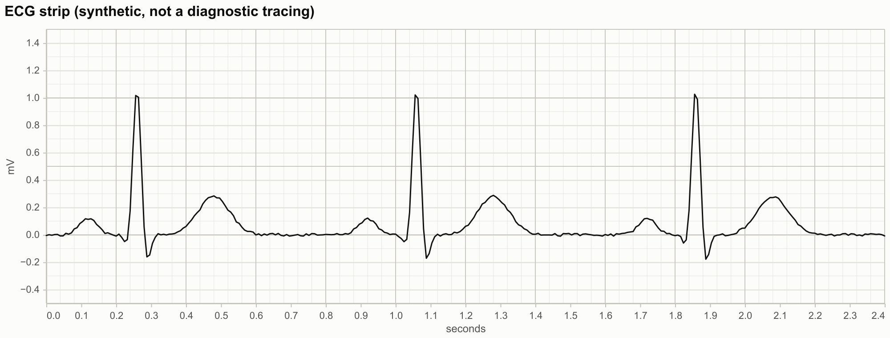

- Takes: `data` as rows `{t, mv}`
- Try it: `(health-chart-demo "ecg-strip")`

#### hrv-trend

Daily heart-rate variability (RMSSD) with a 7-day rolling mean and a personal baseline band; days below the baseline are flagged.

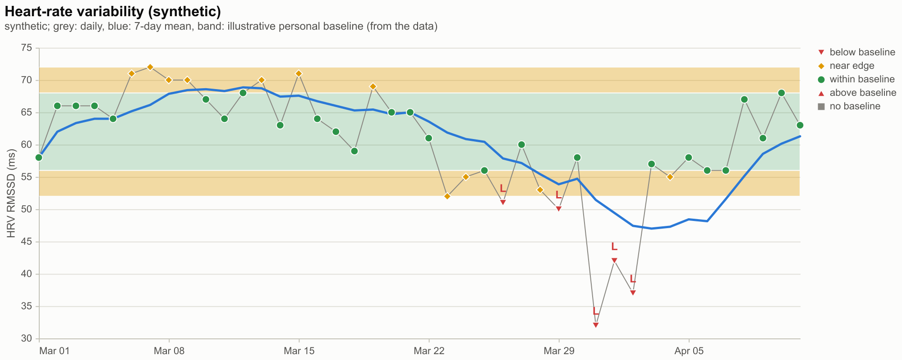

- Takes: `data` as rows `{date, hrv}`
- Required slots: `baseline_low`, `baseline_high`
- Try it: `(health-chart-demo "hrv-trend")`

### Lab results

#### lab-change

Before and after for each analyte on its own reference range: a dumbbell from the earlier result (hollow) to the later one (filled). Improved means nearer the range (or, inside it, nearer its middle); worsened means further; marked by color, glyph and label.

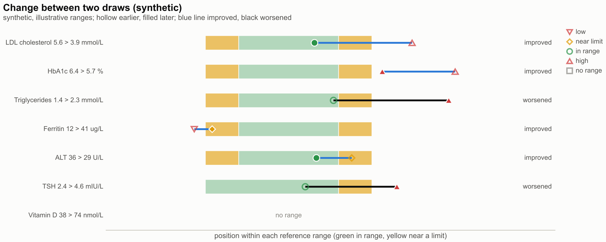

- Takes: `data` as rows `{analyte, [unit], before, after, ref_low, ref_high}`
- Try it: `(health-chart-demo "lab-change")`

#### lab-panel

Small multiples: one compact trend per analyte, each on its own scale with its reference range as a band and out-of-range results flagged by color and shape.

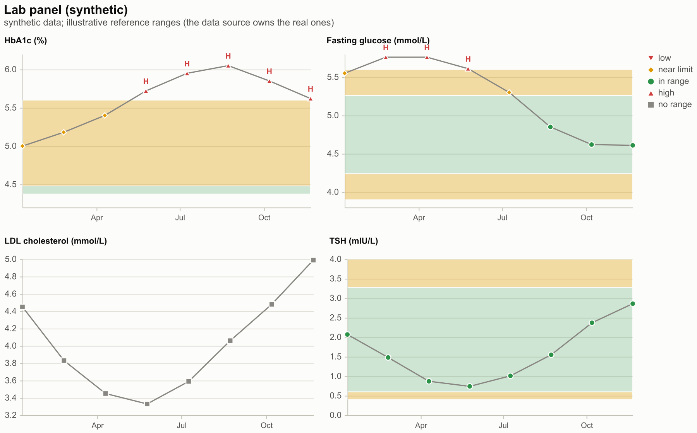

- Takes: `data` as rows `{time, analyte, value}`; `panels` as rows `{analyte, label, [unit], low, high}`
- Required slots: `panels`
- Try it: `(health-chart-demo "lab-panel")`

#### lab-recency

How long ago each test was last drawn, against how often it should be: a bar of days since the last draw and a tick at the recommended interval. Fresh is within the interval, due within 1.5 times it, stale beyond that. The reference date as_of is supplied, never read from a clock.

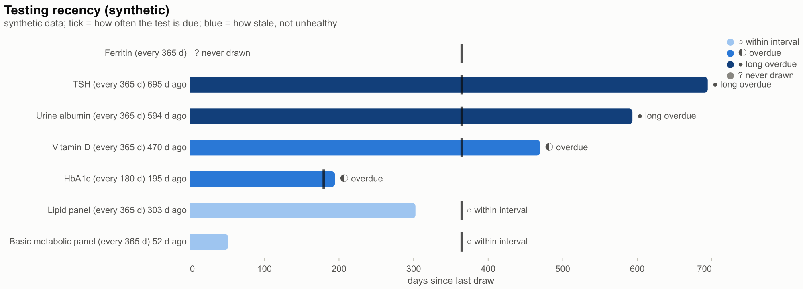

- Takes: `data` as rows `{test, [last_drawn], interval_days}`
- Required slots: `as_of`
- Try it: `(health-chart-demo "lab-recency")`

#### lab-results

Latest result of many analytes, each placed within its own reference range: the range is the bar, the result a marker, and results outside the range are flagged by color, shape and the legend.

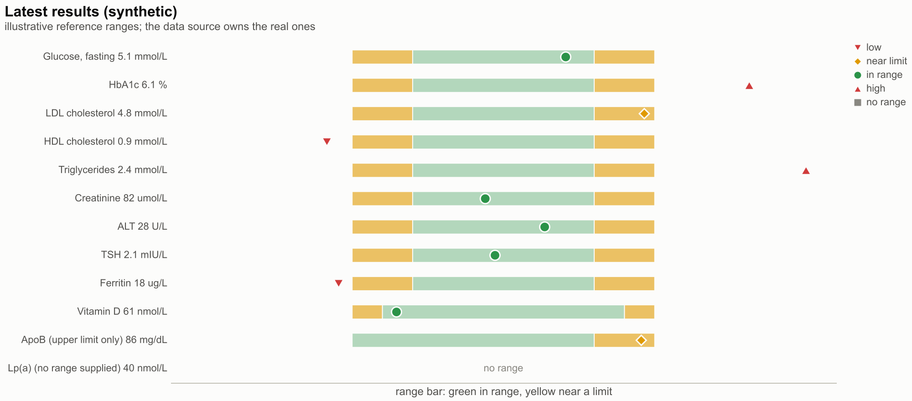

- Takes: `data` as rows `{analyte, value, [unit], ref_low, ref_high}`
- Try it: `(health-chart-demo "lab-results")`

#### lab-status-grid

A grid of analytes by draw date, each cell colored and marked low, in range or high against that row's own reference range, with the glyph and the value in the cell.

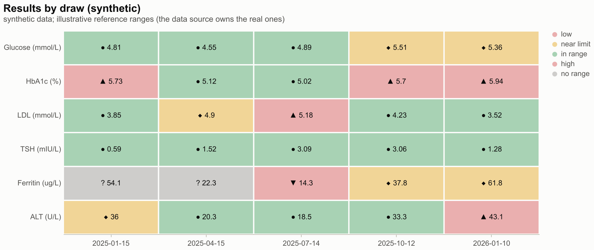

- Takes: `data` as rows `{time, analyte, value, ref_low, ref_high}`
- Try it: `(health-chart-demo "lab-status-grid")`

#### lab-trend

One lab analyte over time against its reference range: the range as a band, an optional optimal band inside it, and results outside the range flagged L or H by color, shape and letter.

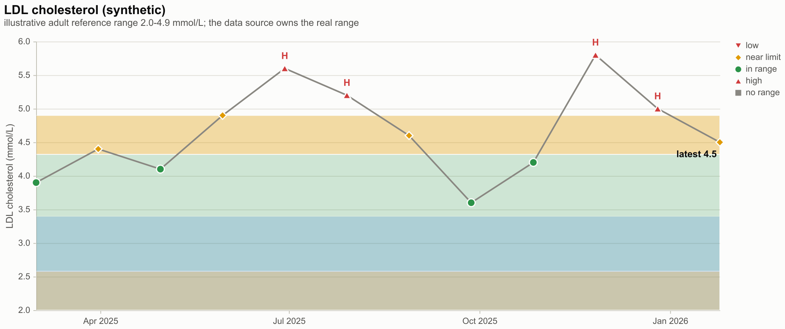

- Takes: `data` as rows `{time, value}`
- Required slots: `low`, `high`
- Try it: `(health-chart-demo "lab-trend")`

#### lipid-panel

A lipid panel against goal lines: one bar per measure (total cholesterol, LDL, HDL, triglycerides, non-HDL), a tick at its goal, an optional hollow marker for the prior draw. Goal met or missed is shown by color, glyph and label, with direction (below or above) per measure.

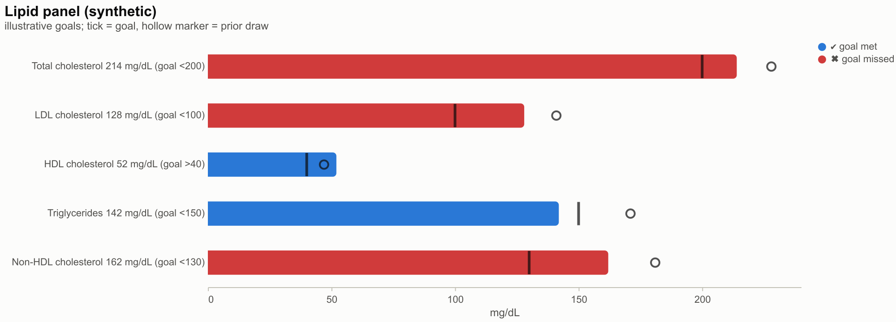

- Takes: `data` as rows `{analyte, value, [unit], goal, direction, [prior]}`
- Try it: `(health-chart-demo "lipid-panel")`

### Glucose and diabetes

#### agp

Ambulatory glucose profile: many days of readings folded onto one 24 hour day as the median line with the 25-75th and 5-95th percentile bands and the target range limits.

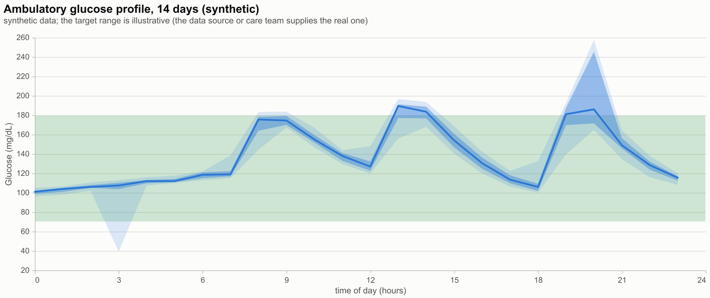

- Takes: `data` as rows `{time, glucose}`
- Try it: `(health-chart-demo "agp")`

#### cgm-day

A continuous glucose monitor day: the glucose line over 24 hours, the target range as a band, very low and very high limits as dashed rules, readings outside the range flagged by colour and shape.

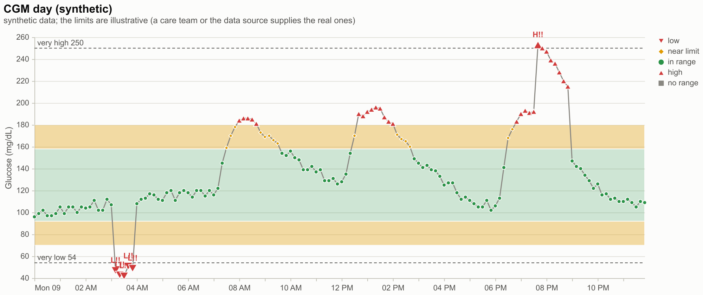

- Takes: `data` as rows `{time, glucose}`
- Try it: `(health-chart-demo "cgm-day")`

#### time-in-range

Time in range: the share of glucose readings very low, low, in range, high and very high per period (weeks, days, any label you give), computed from the raw readings; the consensus target is over 70 percent in range.

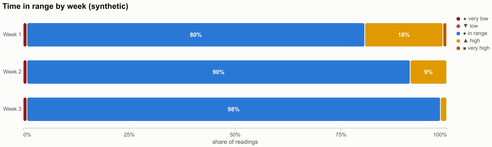

- Takes: `data` as rows `{time, glucose, [period]}`
- Try it: `(health-chart-demo "time-in-range")`

### Trends against published categories (A1c, eGFR, BMI)

#### a1c-trend

HbA1c (%) over time against the ADA diagnostic categories (under 5.7 normal, 5.7-6.4 prediabetes, 6.5 and over diabetes), with an optional personal target line.

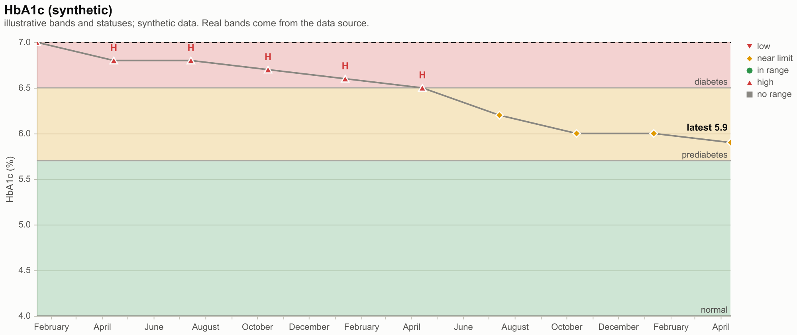

- Takes: `data` as rows `{time, value}`; `bands` (optional) as rows `{label, low, high, [color]}`
- Try it: `(health-chart-demo "a1c-trend")`

#### egfr-trend

Estimated GFR (mL/min/1.73 m2) over time against the KDIGO CKD stage bands G1 to G5.

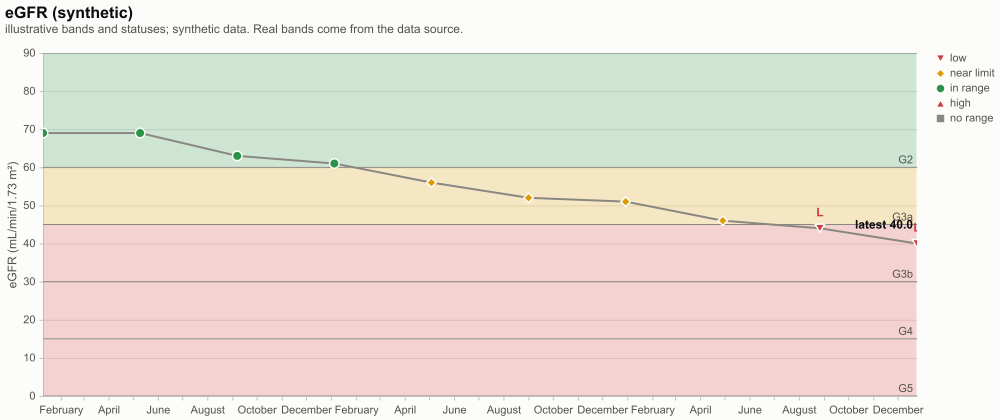

- Takes: `data` as rows `{time, value}`; `bands` (optional) as rows `{label, low, high, [color]}`
- Try it: `(health-chart-demo "egfr-trend")`

#### weight-bmi-trend

BMI over time, computed from weight and height, against the WHO adult categories (under 18.5, 18.5-24.9, 25-29.9, 30 and over); the weight is in the tooltip.

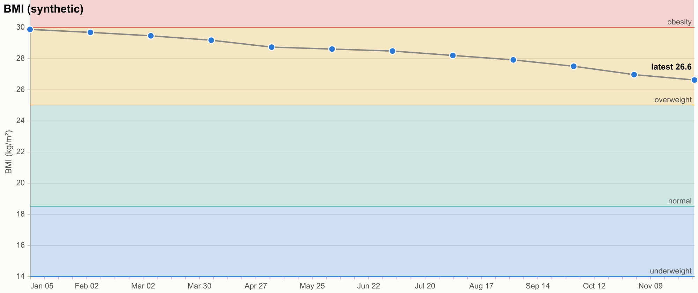

- Takes: `data` as rows `{time, weight_kg}`; `bands` (optional) as rows `{label, low, high, [color]}`
- Required slots: `height_m`
- Try it: `(health-chart-demo "weight-bmi-trend")`

### Fluids

#### fluid-balance

Fluid balance per day: intake bars up, output bars down, in millilitres, with the net balance marked and labelled; the totals are computed from the individual entries.

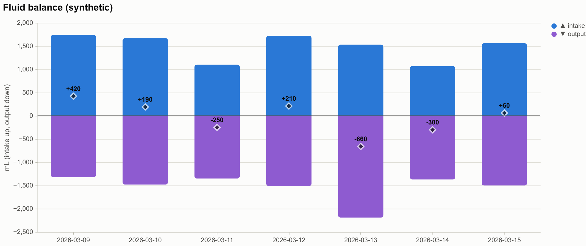

- Takes: `data` as rows `{time, kind, ml, [source]}`
- Try it: `(health-chart-demo "fluid-balance")`

### Medication

#### medication-timeline

Medication courses as bars on a timeline, each scheduled dose marked taken, late or missed (shape and colour), with the adherence share per medication.

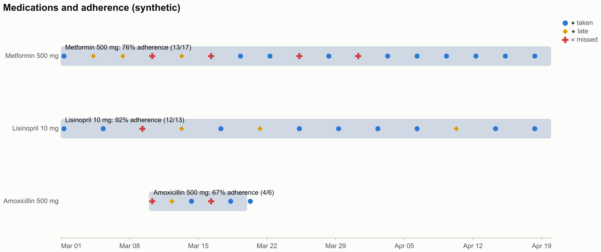

- Takes: `courses` as rows `{medication, start, end, [dose]}`; `doses` as rows `{medication, time, status}`
- Try it: `(health-chart-demo "medication-timeline")`

### Immunizations

#### immunization-timeline

Immunization history: one row per vaccine, doses given as filled points, doses still due as grey diamonds and doses due before the as_of date as red triangles.

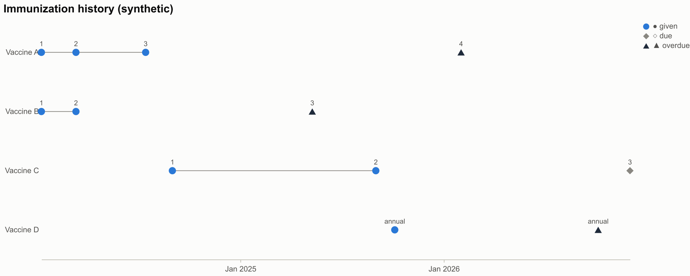

- Takes: `data` as rows `{vaccine, date, [dose], status}`
- Required slots: `as_of`
- Try it: `(health-chart-demo "immunization-timeline")`

### Symptoms

#### symptom-diary

Symptom or pain diary: one row per symptom, one column per day, each cell shaded and numbered by the severity logged (0 none to 10 worst); a note rides in the tooltip.

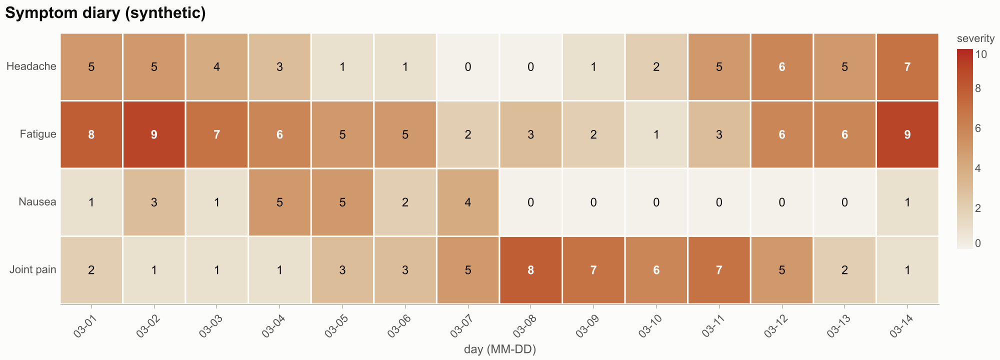

- Takes: `data` as rows `{date, symptom, severity, [note]}`
- Try it: `(health-chart-demo "symptom-diary")`

### Cycle tracking

#### cycle-tracker

Menstrual cycle tracker: one row per cycle on a cycle-day axis, phases as labelled coloured segments and optional daily markers. The caller supplies every phase boundary; nothing is predicted.

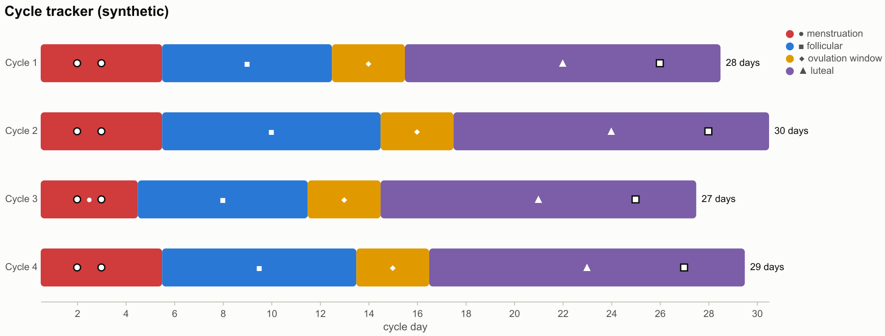

- Takes: `data` as rows `{cycle, start_day, end_day, phase}`; `markers` (optional) as rows `{cycle, day, marker}`
- Try it: `(health-chart-demo "cycle-tracker")`

### Growth

#### growth-chart

Paediatric growth chart: percentile curves bound by the caller (bind published CDC or WHO curves; this package ships none) with the patient's measurements drawn over them. The example curves are synthetic.

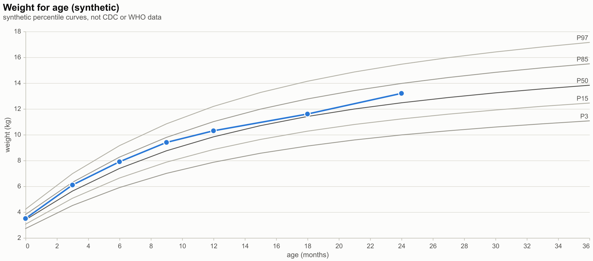

- Takes: `data` as rows `{age, value}`; `curves` as rows `{age, percentile, value}`
- Try it: `(health-chart-demo "growth-chart")`

### Sleep

#### sleep-duration

Nightly sleep as stacked bars by stage, the time in bed in hours above each night and the sleep goal as a dashed line.

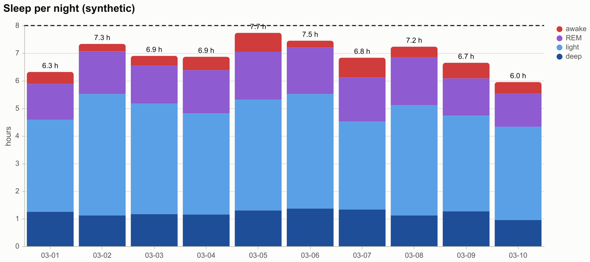

- Takes: `data` as rows `{date, stage, minutes}`
- Try it: `(health-chart-demo "sleep-duration")`

#### sleep-hypnogram

One night of sleep as a hypnogram: the stage (awake, REM, light, deep) over time, one segment per stage change.

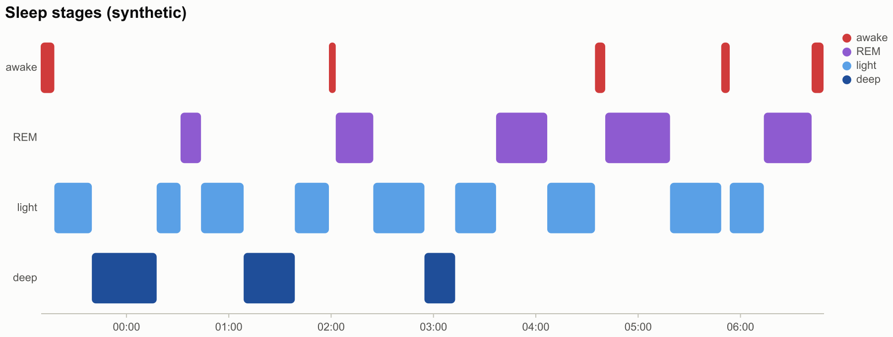

- Takes: `data` as rows `{start, end, stage}`
- Try it: `(health-chart-demo "sleep-hypnogram")`

### Activity and fitness

#### activity-calendar

A calendar heatmap of a daily count such as steps: weeks as columns, weekdays as rows, color by value, a check mark on days that met the goal.

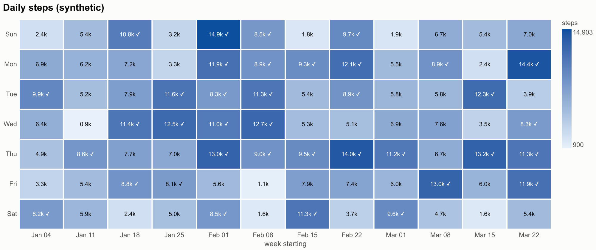

- Takes: `data` as rows `{date, steps}`
- Try it: `(health-chart-demo "activity-calendar")`

#### hr-zones

Time spent in each heart-rate zone as horizontal bars, with the zone's bpm bounds and its share of the total.

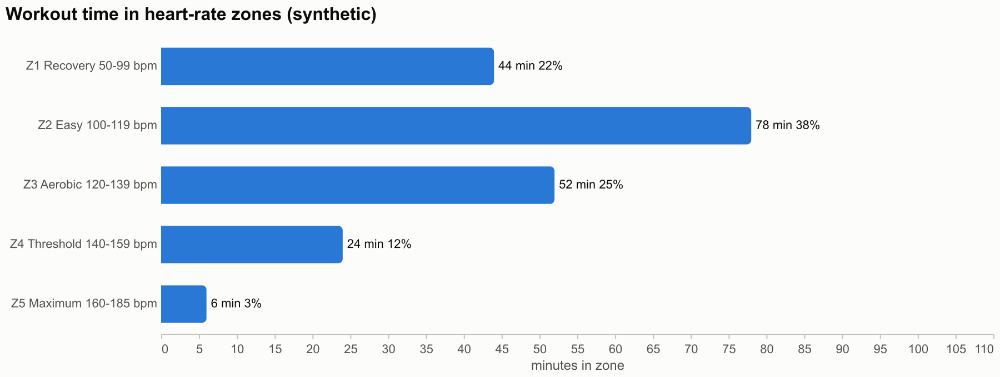

- Takes: `data` as rows `{zone, minutes, low, high}`
- Try it: `(health-chart-demo "hr-zones")`


## API

| Function | Does |
|---|---|
| `(health-chart-list-templates)` | every template as `(NAME :group G :doc D)` |
| `(health-chart-describe-template NAME)` | slots, the rows each table takes, rules, example, default sizes |
| `(health-chart-example NAME)` | synthetic bindings that render as is |
| `(health-chart-validate NAME BINDINGS)` | `t` or `health-chart-invalid-data` |
| `(health-chart-check NAME BINDINGS)` | `t` or `(:code :path :index :field :message)` |
| `(health-chart-render NAME BINDINGS &rest PROPS)` | a string: SVG or text. PROPS: `:backend` (`text`, `svg`, `auto`), `:width`/`:height` (text columns and rows, SVG pixels), `:pixel-width`/`:pixel-height`, `:title`, `:font` |
| `(health-chart-write NAME BINDINGS FILE)` | write SVG (or text for `.txt`) |
| `(health-chart-insert NAME BINDINGS)` | insert at point, as an image or text |
| `(health-chart-open NAME BINDINGS)` | a live eas view in a buffer (hover, crosshair, zoom, the eas agent verbs) |
| `(health-chart-demo NAME)` | open a template over its example |
| `(health-chart-read-bindings FILE-OR-JSON)` | parse bindings |

Errors are typed: `health-chart-unknown-template`, `health-chart-invalid-data`
and `health-chart-backend-error`, all under `health-chart-error`. `auto`
draws SVG in a graphical frame and text in a terminal
(`health-chart-backend`). Text output is deterministic and carries eas's
hover help and datum properties, so an agent can read a chart as text.

The package also registers one eas transform, `time-of-day-percentiles`
(the percentile bands of `agp`), through eas's public registry.

## Adding a template

A template is `templates/NAME.json` (Vega-Lite plus an `x-eas` block of
slots) and `examples/NAME.data.json` (synthetic bindings). Its
`x-eas.health` block names the group, default sizes and what each table
takes; `src/health-chart-validate.el` documents the field types. `make
goldens` writes the goldens and `make test` then breaks every declared field
and expects the right code and path. See `AGENTS.md` and
`docs/design/render-only.md`.

## Tests

```sh
make test EAS=/path/to/eas.el        # ERT: validation, API, goldens for text and SVG
make compile EAS=/path/to/eas.el     # byte-compile, warnings are errors
make checkdoc
make screenshots EAS=/path/to/eas.el # docs/screenshots/*.png (needs rsvg-convert)
```

Goldens live in `test/golden/text` and `test/golden/svg`;
`make goldens` rewrites them, then review the diff.

## License

See [LICENSE](LICENSE).
