# health-charts.el

Biomarker charts in Emacs: lab results in, chart out — an image drawn
by [Vega-Lite](https://vega.github.io/vega-lite/) or
[gnuplot](http://gnuplot.info) in a GUI or an Org file, propertized
unicode text in a terminal. Lisp never draws: it turns the data into a
neutral [chart spec](docs/chartspec.md) and fills a template written in
the backend's own language. Pick a backend per chart or globally, and
bring your own templates. Around that: a kind registry, a shape
registry, a validate / explain / describe surface for programs and
agents, a JSON command line, and ert tests.

[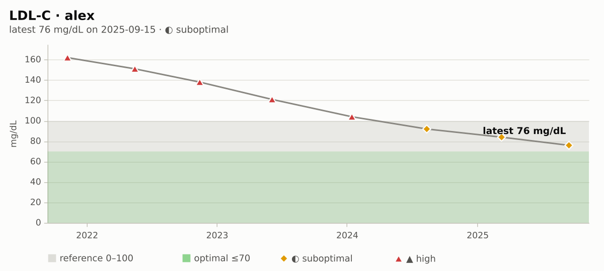](docs/screenshots/vega-lite/timeseries.png)

*`timeseries` with the Vega-Lite backend: one marker's draws, reference
and optimal ranges shaded, each point's status shown as glyph and word.
Data: [`examples/sample-panel.json`](examples/sample-panel.json) (two
made-up people). Regenerate:
[`examples/screenshots.el`](examples/screenshots.el).*

| kind | Vega-Lite | gnuplot |
|---|---|---|
| `bullet`: each latest value in its ranges | 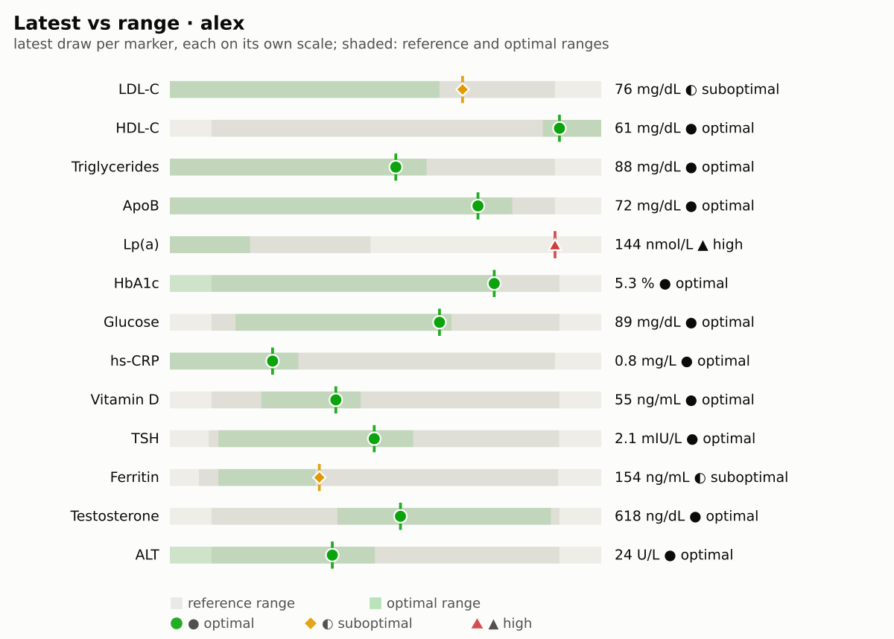 | 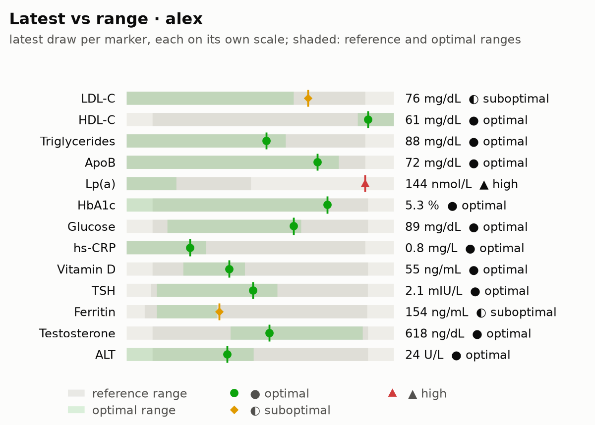 |
| `heatmap`: every draw's status per marker | 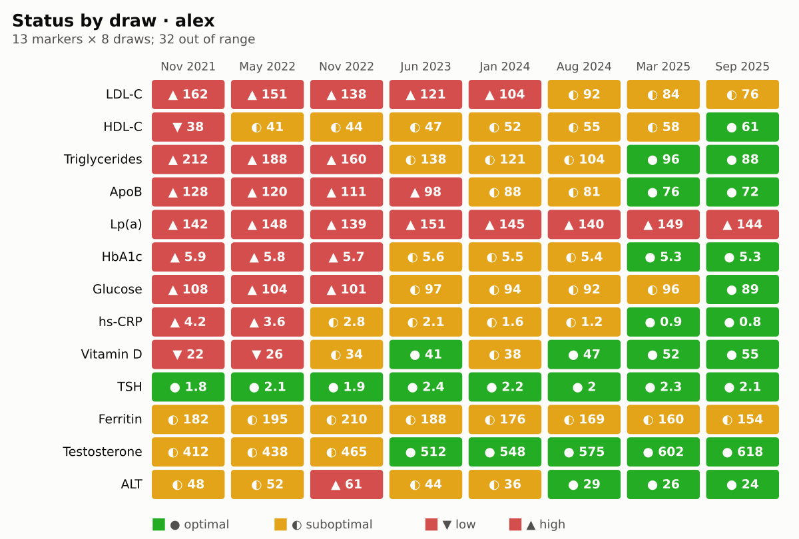 | 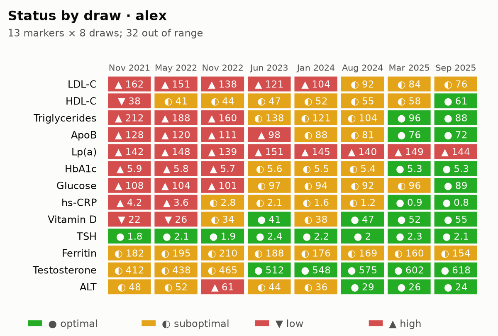 |
| `compare`: one marker, several people | 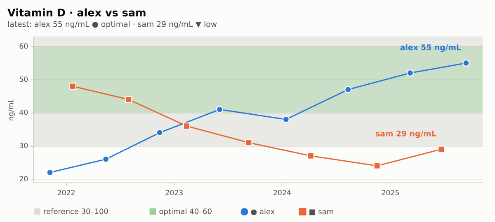 | 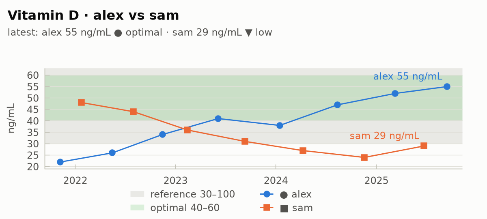 |
| `delta`: change between two draws, toward or away from target | 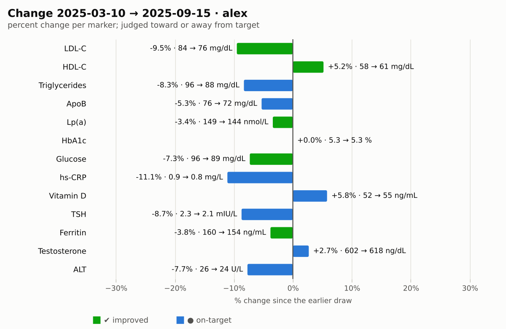 | 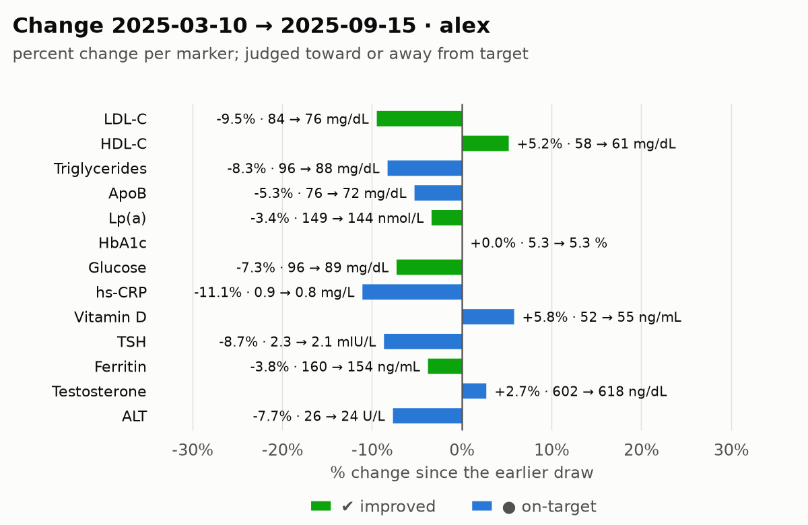 |
| `staleness`: days since each test, against due and stale | 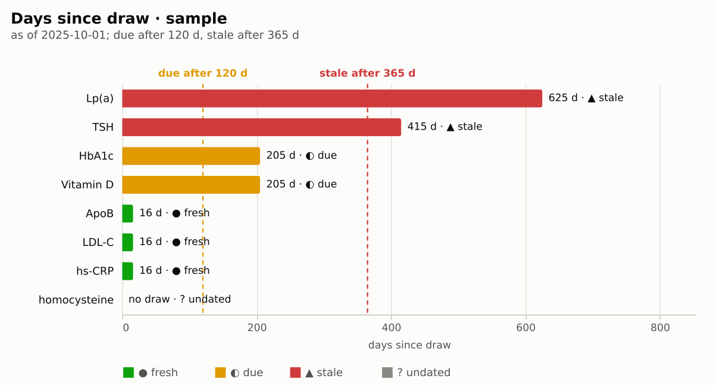 | 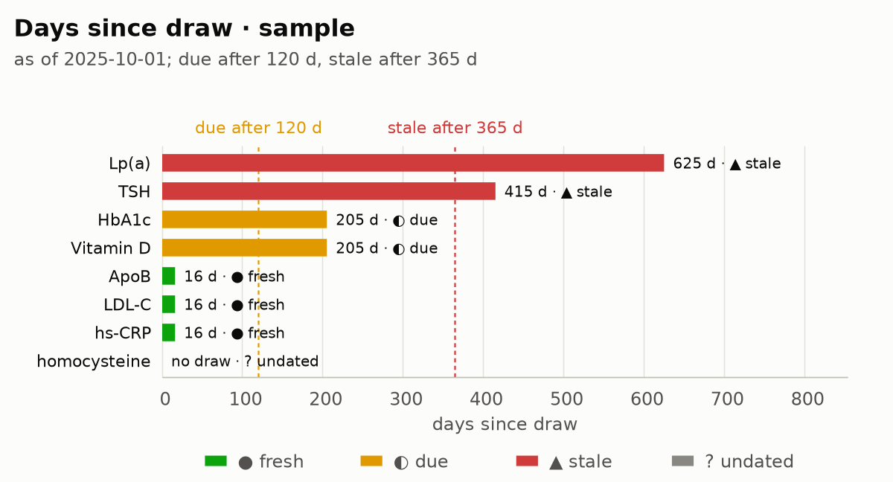 |
| `panel`: a small time series per marker | 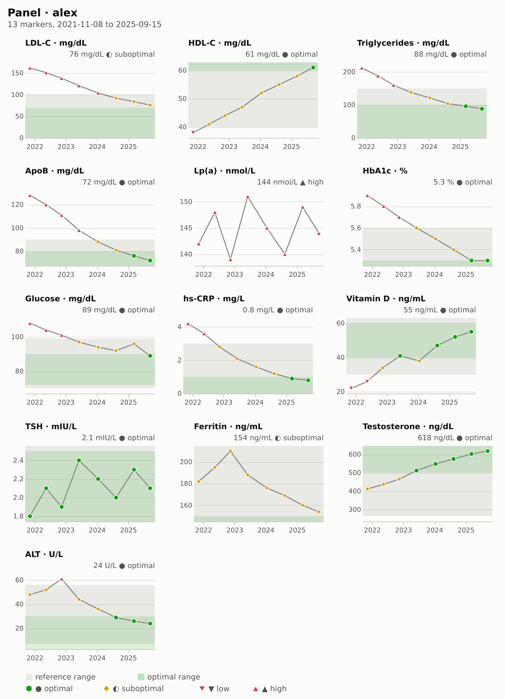 | 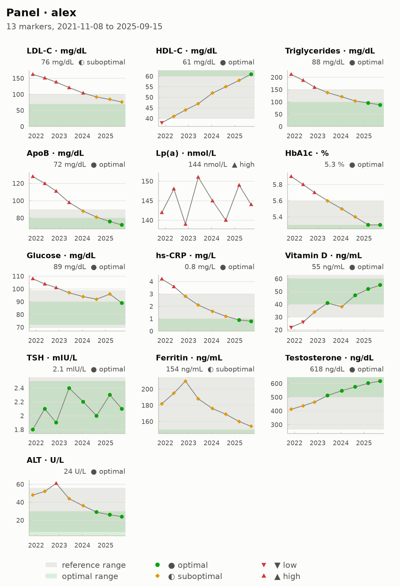 |

*The same spec through both backends, from
[`examples/sample-panel.json`](examples/sample-panel.json); full size
under [Screenshots](#screenshots). Regenerate:
[`examples/screenshots.el`](examples/screenshots.el).*

[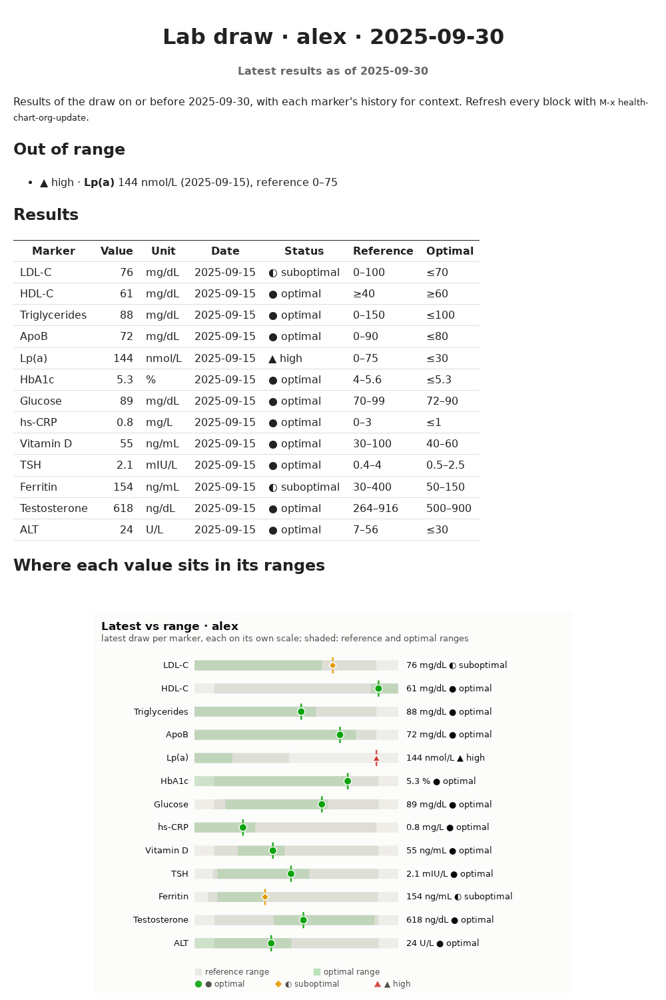](examples/reports/lab-draw.html)

*An [Org report](#org-reports): the `lab-draw` template stamped for a
synthetic person, its dynamic blocks refreshed, exported to HTML. Source:
[`examples/reports/lab-draw.org`](examples/reports/lab-draw.org), data:
[`examples/sample-panel.json`](examples/sample-panel.json). Regenerate:
[`examples/reports.el`](examples/reports.el), then
[`examples/report-screenshot.sh`](examples/report-screenshot.sh).*

### 60-second usage

```elisp
(require 'health-chart)
;; no biomarker CLI needed: serve the synthetic sample panel
(setq health-chart-source-function #'health-chart-source-static
      health-chart-source-static-data (json-read-file "examples/sample-panel.json"))

(health-chart-write 'timeseries (health-chart-source-trend :person "alex" :marker "ldl-c")
                    "ldl.svg")                                  ; image file
(health-chart-plot 'bullet (health-chart-source-latest :person "alex")
                   :backend 'text)                              ; unicode, any terminal
(health-chart-org-new-report "lab-draw" "draw.org"
                             :person "alex" :until "2025-09-30") ; a whole Org report
```

or in any Org file, then `C-c C-c` on the `#+BEGIN` line:

```org
#+BEGIN: health-chart :kind timeseries :person "alex" :marker "ldl-c" :caption "LDL-C"
#+END:
```

Data comes from plain Lisp (plists or alists) or from
[biomarker-cli](#data-source-biomarker-cli) through a thin, swappable
source layer. Every example in this file uses synthetic data.

- [Install](#install)
- [Use](#use)
- [Chart kinds](#chart-kinds)
- [Backends](#backends)
- [Screenshots](#screenshots)
- [Templates](#templates)
- [Org reports](#org-reports)
- [The dashboard](#the-dashboard)
- [Data: plain Lisp](#data-plain-lisp)
- [Data source: biomarker-cli](#data-source-biomarker-cli)
- [For programs and agents](#for-programs-and-agents)
- [Command line](#command-line)
- [Customization](#customization)
- [Layout](#layout)
- [Tests](#tests)

## Install

Requires Emacs 29.1 or later and no Emacs packages. Images need at
least one backend tool (see [Backends](#backends)); without any, every
kind still renders as unicode text. Showing images inline needs an
Emacs built with librsvg (SVG) or libpng.

```sh
npm i -g vega vega-lite vega-cli   # vega-lite backend (vl2svg, vl2png, vl2pdf)
brew install gnuplot               # gnuplot backend, 5.4 or later (apt: gnuplot-nox)
brew install librsvg               # rsvg-convert: vega-lite PNG/PDF without node-canvas
```

```elisp
(use-package health-chart
  :load-path "~/src/health-charts.el"
  :commands (health-charts health-chart-plot health-chart-plot-view)
  :custom
  (health-chart-source-executable "biomarker")
  (health-chart-default-person "alex"))
```

or `(add-to-list 'load-path "~/src/health-charts.el")` and
`(require 'health-chart)`.

## Use

`M-x health-charts` opens the dashboard. `M-x health-chart-demo` shows
every kind over built-in synthetic data, no CLI needed.

From Lisp, one function draws any kind:

```elisp
(health-chart-render KIND DATA &rest PROPS)      ; -> image object in a GUI, text in a terminal
(health-chart-render KIND DATA :format 'png)     ; -> that format as a string (svg png pdf text vega-lite)
(health-chart-write KIND DATA "ldl.png" &rest PROPS) ; -> file; format from the extension
(health-chart-plot KIND DATA &rest PROPS)        ; -> string (SVG document or text)
(health-chart-plot-insert KIND DATA &rest PROPS) ; at point
(health-chart-plot-view KIND DATA &rest PROPS)   ; in its own buffer
(health-chart-spec KIND DATA &rest PROPS)        ; -> the chartspec/v1 plist, pure
```

```elisp
(health-chart-write 'timeseries (health-chart-source-trend :marker "ldl-c")
                    "~/notes/ldl.svg" :backend 'vega-lite)
(health-chart-render 'heatmap (health-chart-source-query :person "alex")
                     :backend 'gnuplot :format 'vega-lite) ; signals: gnuplot writes no Vega-Lite
```

In Org, `health-chart-write` returns the file, so a source block can
produce the image link (`:format 'vega-lite` gives the spec JSON for a
web page instead):

```org
#+begin_src emacs-lisp :results file
(health-chart-write 'timeseries (health-chart-source-trend :marker "ldl-c") "ldl.svg")
#+end_src
```

```elisp
(health-chart-plot 'timeseries (health-chart-source-trend :marker "ldl_c")
                   :backend 'text :width 72)
```

```
LDL-C · alex · mg/dL   latest 88 mg/dL (2025-06-02) ◐ suboptimal
    │●······
    │       ······●···
120 ┤                 ······
    │                       ···●···                    ···●··
    │                              ·······       ······      ····
100 ┤░░░░░░░░░░░░░░░░░░░░░░░░░░░░░░░░░░░░░···●···░░░░░░░░░░░░░░░░····░░░
    │░░░░░░░░░░░░░░░░░░░░░░░░░░░░░░░░░░░░░░░░░░░░░░░░░░░░░░░░░░░░░░░░··●
 80 ┤░░░░░░░░░░░░░░░░░░░░░░░░░░░░░░░░░░░░░░░░░░░░░░░░░░░░░░░░░░░░░░░░░░░
    │░░░░░░░░░░░░░░░░░░░░░░░░░░░░░░░░░░░░░░░░░░░░░░░░░░░░░░░░░░░░░░░░░░░
    │▒▒▒▒▒▒▒▒▒▒▒▒▒▒▒▒▒▒▒▒▒▒▒▒▒▒▒▒▒▒▒▒▒▒▒▒▒▒▒▒▒▒▒▒▒▒▒▒▒▒▒▒▒▒▒▒▒▒▒▒▒▒▒▒▒▒▒
    └───────────────────────────────────────────────────────────────────
     2024-03-04                  2024-10-17                   2025-06-02
● value   ▒ optimal ≤70   ░ reference 0–100
```

Common props:

| prop | meaning |
|---|---|
| `:backend` | `auto` (default `health-chart-backend`), `vega-lite`, `gnuplot`, `text`, or `svg` (native, obsolete) |
| `:format` | `svg`, `png`, `pdf`, `text` or `vega-lite` (the filled Vega-Lite JSON, for Org or the web) |
| `:width` `:height` | text columns overall / plot rows |
| `:pixel-width` `:pixel-height` | image size in CSS pixels (default `health-chart-image-width`, 720) |
| `:scale` | PNG pixel ratio (`health-chart-image-scale`, 1) |
| `:theme` | `light` or `dark` (default `health-chart-theme`, `auto`) |
| `:person` `:marker` | which person and marker to draw (default: the first present) |
| `:ref` `:optimal` | shade the reference / optimal band (default `health-chart-show-ref-range` / `-optimal-range`) |
| `:title` | replaces the derived title |
| `:from` `:to` | `delta`: the two draw dates (default: the latest two) |
| `:columns` | `panel`: cells per row |

Every status is shown as a glyph *and* a word, never color alone:
`● optimal`, `○ normal` (in range, no optimal range known),
`◐ suboptimal` (in the reference range, outside optimal), `▲ high`,
`▼ low`, `? n/a`. The reference and optimal bounds decide the status;
the source's `flag` is used only when a measurement has no ranges.

## Chart kinds

`(health-chart-list-kinds)` lists them. Every kind has a native text
renderer; the seven marked ◆ also have templates for both image
backends (`(health-chart-templates)` lists them).

| kind | shows |
|---|---|
| `timeseries` ◆ | one marker over time, reference (░) and optimal (▒) ranges shaded, points by status |
| `panel` ◆ | small multiples: a compact time series per marker |
| `table` | sparkline table: marker, latest, date, trend, flag, reference |
| `bullet` ◆ | range bars: where each latest value sits in its ranges |
| `heatmap` ◆ | markers by draw dates, each cell the draw's status |
| `compare` ◆ | one marker over time for several people, one glyph/color each |
| `delta` ◆ | percent change per marker between two draws, judged against target |
| `sparkline` | one-row sparkline of plain numbers |
| `scorecard` | indicator values: indicator, value, unit, status, trend sparkline |
| `cohort` | cohort panel: a card per indicator with value, status, range track, trend |
| `staleness` ◆ | days since each indicator's draw, against due and stale lines |

The last three take indicator values, not measurements; see
[Indicators and cohorts](#indicators-and-cohorts).

`table`:

```
Biomarkers · alex
Marker            Latest  Date        Trend         Flag          Reference
LDL-C           88 mg/dL  2025-06-02  █▇▄▂▅▁        ◐ suboptimal  0–100 (opt ≤70)
HDL-C           61 mg/dL  2025-06-02  ▁▃▆▅▃█        ● optimal     ≥40 (opt ≥60)
Triglycerides  104 mg/dL  2025-06-02  █▅▃▃▅▁        ◐ suboptimal  0–150 (opt ≤100)
hs-CRP          3.4 mg/L  2025-06-02  ▄█▃▁▄▇        ▲ high        ≤3 (opt ≤1)
```

`bullet`:

```
Latest vs range · alex
LDL-C          ▒▒▒▒▒▒▒▒▒▒▒▒▒▒▒▒▒▒▒▒░░░░░┃░░░───   88 mg/dL  ◐ suboptimal
HDL-C          ───░░░░░░░░░░░░░░░░░░░░░░░░░┃▒▒▒   61 mg/dL  ● optimal
Vitamin D      ───░░░░▒▒┃▒▒▒▒░░░░░░░░░░░░░░░───   48 ng/mL  ● optimal
hs-CRP         ▒▒▒░░░░░░░░░░░░░░░░░░░░░░───┃───   3.4 mg/L  ▲ high
┃ latest   ▒ optimal   ░ reference   ─ outside
```

`heatmap`:

```
Out of range · alex
               24 24 24 24 25 25
               03 06 09 12 03 06  out
LDL-C           ▲  ▲  ▲  ◐  ▲  ◐  4/6
HDL-C           ◐  ◐  ◐  ◐  ◐  ●  0/6
Vitamin D       ▼  ◐  ◐  ●  ◐  ●  1/6
● optimal  ○ normal  ◐ suboptimal  ▲ high  ▼ low  · no draw
```

`delta` — a verdict per marker: `improved` / `worsened` (closer to /
further from the optimal range, or the reference range when there is no
optimal one), `on-target` (inside it both times), `steady`:

```
Change 2025-03-03 → 2025-06-02 · alex
LDL-C          112 → 88 mg/dL         ███│            -21.4%  improved
Vitamin D      36 → 48 ng/mL             │█████       +33.3%  improved
TSH            2.4 → 2.1 mIU/L         ██│            -12.5%  on-target
hs-CRP         2.1 → 3.4 mg/L            │█████████   +61.9%  worsened
```

`compare` overlays people with distinct glyphs (and colors in SVG):

```elisp
(health-chart-plot 'compare (health-chart-source-trend :marker "vitamin_d" :person nil)
                   :backend 'text)
```

SVG output uses a palette with selected light and dark variants
(`health-chart-svg-theme`), reserved status colors that always travel
with a glyph and a label, and a hover `<title>` on every point, bar and
cell. Each document carries a `<title>`/`<desc>` naming the kind and
data extent, so a saved file explains itself.

## Backends

| backend | formats | needs | role |
|---|---|---|---|
| `vega-lite` | svg, png, pdf, vega-lite | `vl2svg` (`npm i -g vega vega-lite vega-cli`); PNG/PDF via `vl2png`/`vl2pdf` (node-canvas) or `vl2svg` + `rsvg-convert` | first choice for images |
| `gnuplot` | svg, png, pdf, text | `gnuplot` 5.4+ (`brew install gnuplot`) with the cairo terminals | images when Vega-Lite is missing; first choice in a terminal (`dumb`) |
| `text` | text | nothing | native unicode renderers; last-resort terminal fallback, and the only renderer of `table`, `sparkline`, `scorecard`, `cohort` |
| `svg` | svg | nothing | native SVG renderers: **obsolete**, never chosen by default, no new features |

`health-chart-backend` (or `:backend` per call) is `auto` by default:

- where images can be shown (GUI frame, or an image `:format`): the
  first of `health-chart-graphic-backends` (`vega-lite`, `gnuplot`)
  that is installed and has a template for the kind;
- in a terminal: the first of `health-chart-terminal-backends`
  (`gnuplot`, `text`);
- otherwise native text.

`(health-chart-explain KIND DATA)` says which backend and why, and for
a template backend shows the template file, the generated program and
the exact argv of each step. Programs go to the tools on stdin — no
shell is involved, so no value is ever shell-interpolated. The Vega-Lite
commands are `health-chart-vl2svg-command`, `-vl2png-command`,
`-vl2pdf-command` (nil: the tool on `exec-path`, else
`npx -p vega -p vega-lite -p vega-cli vl2svg`); `vl2png`/`vl2pdf` need
node-canvas, and when they fail the backend renders `vl2svg | rsvg-convert`
instead (`health-chart-vega-lite-raster`). `M-x health-chart-doctor`
reports which tools are installed and checks every template.

## Screenshots

Every templated kind rendered from the synthetic
[`examples/sample-panel.csv`](examples/sample-panel.csv) (two made-up
people, thirteen markers, seven or eight draws over four years) by both
backends, 1200 px wide. Regenerate with
`emacs -Q --batch -L . -l examples/screenshots.el`.

| kind | Vega-Lite | gnuplot |
|---|---|---|
| `timeseries` |  | 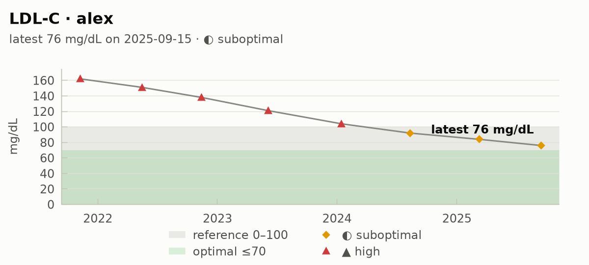 |
| `panel` |  |  |
| `bullet` |  |  |
| `heatmap` |  |  |
| `compare` |  |  |
| `delta` |  |  |
| `staleness` |  |  |

## Templates

A template is a chart program in the backend's own language with
placeholders where the [chart spec](docs/chartspec.md) goes:
`templates/vega-lite/KIND.vl.json` (a Vega-Lite spec, data inlined
under `"data": {"values": {{data}}}`) and `templates/gnuplot/KIND.gp`
(a gnuplot script, data inlined as `$data << EOD … EOD` blocks).

Templates are looked up in `health-chart-template-directories` first,
then the bundled `templates/`; the first `DIR/BACKEND/KIND.EXT` wins.
So to restyle a chart, copy its template into your directory and edit
it; to add a kind, drop a file in:

```elisp
(setq health-chart-template-directories '("~/.emacs.d/health-chart-templates"))
;; ~/.emacs.d/health-chart-templates/vega-lite/my-kind.vl.json
(health-chart-render 'my-kind (health-chart-source-query :person "alex")
                     :backend 'vega-lite)
```

A template-only kind takes measurements; its spec has every measurement
as a row plus the timeseries members of the first marker.
`(health-chart-templates)` lists every `(backend, kind)` with its path
and whether it is yours or bundled.

### Placeholder syntax

| form | inserts |
|---|---|
| `{{title}}` | a member of the spec, escaped for the template's language |
| `{{overlays.ref_low}}` | a nested member (dot path, snake_case as in the JSON) |
| `{{legend.label}}` | a member of every element of an array: an array |
| `{{x.ticks.0.label}}` | an array element by index |
| `{{data}}` | the spec's `rows` |
| `{{rows\|length}}` | an array's element count |
| `{{width\|bare}}` | a number or plain word unquoted (anything else is an error) |
| `{{x\|json}}` / `{{rows\|data}}` | force JSON / datablock encoding |

Escaping by language:

| value | Vega-Lite (JSON) | gnuplot |
|---|---|---|
| string | `"JSON string"` | `'single-quoted'` (no backslash or backquote substitution; `'` doubled) |
| number | `76`, `5.3` | `76`, `5.3` |
| null | `null` | `NaN` |
| array of scalars | JSON array | array literal `['a', 'b']` (for `array A = {{…}}`) |
| array of objects | JSON array of objects | tab-separated lines with a header row, for a `$data << EOD` block |
| object | JSON object | an error: name a member |

Templates also see `{{format}}` (`svg`, `png`, `pdf`, `text`,
`vega-lite`) and `{{scale}}`. The gnuplot backend prepends the terminal
(`svg`, `pngcairo`, `pdfcairo` sized from `width`/`height`, or `dumb`
for text), `set output`, `set encoding utf8`, `set datafile separator
"\t"` and `set datafile columnheaders`, so templates address columns by
name: `plot $data using 'date':'value'`. An unknown placeholder fails
with the template's file and line. Keep the house rule: every status
shows its glyph and word (`{{legend.label}}`), never color alone.

## Org reports

`health-chart-org.el` composes charts, tables and indicator scorecards
into Org documents with dynamic blocks. Refresh one block with `C-c C-c`
on its `#+BEGIN` line, every health block with `M-x
health-chart-org-update` (or `org-update-all-dblocks`). It loads on first
use; plain charts never load Org.

| block | writes |
|---|---|
| `health-chart` | the chart image, via `health-chart-write`, into the document's asset directory, and its `[[file:...]]` link (`#+CAPTION` from `:caption`). A kind no image template draws (`scorecard`, `cohort`, `table`), or `:backend text`, becomes a text chart in an example block |
| `health-table` | the latest value per marker: marker, value, unit, date, status (glyph and word), reference, optimal; with a `#+PLOT` line (above the table, where org-plot reads it) so `C-c " g` charts it too |
| `health-scorecard` | a cohort's indicator values with status and trend words |
| `health-flags` | the markers whose latest value is out of range, as a list |
| `health-genetics` | genetics.el's `genetics-summary`, `genetics-hits` or `genetics-apoe` block (`:section summary\|hits\|apoe`, `:kit NAME` or `:file KIT`) when genetics.el is loaded; never loads it, and writes a one-line note without it |

Params: `:person :marker :markers :category :cohort :since :until
:as-of` select the data (`:cohort` takes one name or a list);
`:kind :backend :format (svg png pdf) :width :height :title :columns
:file :caption` shape the chart, and `:baseline DATE` makes a `delta`
compare the last draw on or before DATE with the latest. Without
`:kind` a block with `:cohort` draws `staleness`, one `:marker` a
`timeseries`, anything else a `panel`.

```org
#+BEGIN: health-flags :person "alex"
- ▲ high · *Lp(a)* 144 nmol/L (2025-09-15), reference 0–75
#+END:

#+BEGIN: health-chart :kind delta :person "alex" :baseline "2024-10-01" :caption "Since last year"
#+CAPTION: Since last year
#+ATTR_HTML: :alt Since last year
[[file:report-assets/delta-alex-b2c523aa.svg]]
#+END:
```

Images go to `health-chart-org-asset-directory` (default `"%s-assets"`,
`%s` the document's base name, next to it) under a stable name: the
kind, person, markers and cohort plus a hash of every param that
changes the picture. Re-running a block rewrites the same file;
`:file` picks the path yourself. A block that fails writes one Org
comment line with the error code and how to fix it, e.g.
`# health-table (source_missing): cannot find biomarker; install
biomarker-cli or set ...`, and never breaks the document.

Each block has a pure explain twin that returns the data query (the
source call or cohort plans, the local filter) and the output path
without fetching or drawing: `health-chart-org-chart-explain`,
`-table-explain`, `-scorecard-explain`, `-flags-explain`,
`-genetics-explain`; `(health-chart-org-explain "health-chart" PARAMS
[ORG-FILE])` dispatches by name and `M-x health-chart-org-explain-block`
explains the block at point.

**Report templates** are plain Org files in `templates/org/`; files in
`health-chart-org-template-directories` come first and shadow them.

| template | contents |
|---|---|
| `lab-draw` | one draw: flags, results table, bullet chart, per-category panels |
| `annual-review` | a year: panel, heatmap, delta vs the year before, cohort scorecards, due tests (staleness), remaining flags |
| `cardiometabolic` | the cardio and metabolic cohorts, a time series per marker, the latest values |
| `genetics-summary` | genetics.el blocks only |
| `full-health-report` | labs and genetics composed |

They use the chart templates' placeholder syntax, filled once at stamp
time: `{{person}}`, `{{date}}`, `{{since}}`, `{{until}}`, `{{period}}`
(`"since – until"`) and `{{year}}`. `M-x health-chart-org-new-report`
asks for a template, person, period and output file, stamps it,
refreshes every block and opens it; from Lisp:

```elisp
(health-chart-org-new-report "annual-review" "~/notes/review-2025.org"
                             :person "alex" :since "2024-10-01" :until "2025-09-30")
(health-chart-org-new-report-explain "annual-review" "~/notes/review-2025.org"
                                     :person "alex")   ; pure: context, assets, block plans
(health-chart-org-templates)                           ; M-x lists them
```

**Export.** HTML export shows the SVG images inline. For LaTeX/PDF,
`health-chart-org-latex-png` (on by default) re-runs the chart blocks
in the export copy as PNG at 2× density, so the document keeps its SVG
links; `:format png` on a block does the same permanently.
[`examples/reports/`](examples/reports/) holds every template stamped
for the sample panel with its images and HTML export; regenerate with
`emacs -Q --batch -L . -l examples/reports.el`.

## The dashboard

`M-x health-charts` (an alias of `health-chart-dashboard`; with a prefix
argument it asks for the person) shows one person's sparkline table, then
the kinds in `health-chart-dashboard-sections` (range bars and the
heatmap by default).

| key | action |
|---|---|
| `RET` | open the marker at point as a time series |
| `m` | compare the marker at point across every person |
| `s` | select person |
| `c` | filter by category (`health-chart-marker-categories`) |
| `C` | select an indicator cohort (or `none`); its scorecard is drawn below the table |
| `K` | open the selected cohort as a cohort panel |
| `v` | small-multiples panel of the visible markers |
| `d` | change between the two latest draws |
| `g` | refetch from the source and redraw |
| `t` | toggle text / image (Vega-Lite or gnuplot) for the chart sections |
| `r` / `o` | toggle the reference / optimal band |
| `n` / `p` | next / previous marker row |
| `q` | quit |

Chart buffers opened from it (`health-chart-plot-mode`) have `g`
(redraw), `t`, `r` and `o` too. Source errors are shown in the buffer
with the fix, never swallowed.

## Indicators and cohorts

An **indicator** is a named recipe — "latest ApoB", "days since the last
draw", "markers out of range" — described by an external catalog and
evaluated here over measurements. A **cohort** is a named set of
indicators (`cardio`, `metabolic`, `inflammation`, `vitamins`,
`overview`), kept as data in `health-chart-indicator-cohorts`.

```elisp
(health-chart-list-cohorts)                  ; summary per cohort, pure
(health-chart-describe-cohort 'cardio)       ; does each member resolve? is it in the catalog?
(health-chart-cohort-values 'cardio :person "alex")    ; fetch + evaluate -> indicator values
(health-chart-cohort-plot 'cardio :person "alex" :kind 'scorecard :backend 'text)
(health-chart-cohort-view 'vitamins 'staleness)        ; M-x health-chart-cohort-view
```

```
Indicators · cardio
Indicator        Value  Unit      Status        Trend
ApoB                84  mg/dL     ◐ suboptimal  █▆▃▂▄▁       ↘ improved
Lp(a)              140  nmol/L    ▲ high        ▁█           ↗ worsened
HbA1c              5.4  %         ○ normal      █▅▁          ↘ improved
Vitamin D           26  ng/mL     ▼ low         █▄▁          ↘ worsened
Ferritin           n/a  ng/mL     ? n/a
```

```
Days since draw · cardio · as of 2025-08-01
Lp(a)            2024-02-12  ████████████████████  536 d  ▲ stale
Vitamin D        2024-11-18  ██████████───│──────  256 d  ◐ due
ApoB             2025-06-02  ██──┆────────│──────   60 d  ● fresh
Ferritin         no draw     ────┆────────│──────      –  ? undated
┆ due after 120 d   │ stale after 365 d   ● fresh  ◐ due  ▲ stale
```

**The catalog.** `health-chart-indicator-catalog-function` (nil by
default) is a function called as `(FN RECIPE-ID)` → that indicator's
record, or nil, and as `(FN nil)` → every record (when it returns nil,
listing probes each known id instead). A record is the resource-catalog
object

```json
{"ref": {"kind": "indicator", "id": "health.cardio.apob"},
 "name": "Apolipoprotein B", "revision": "1.0.0",
 "attributes": {"description": "...", "owner": "...", "tags": ["health", "cardio"],
                "parameters": {}, "recipe": {...},
                "value": {"type": "number", "unit": "mg/dL", "scale": "linear",
                          "bounds": {"min": null, "max": 90}},
                "semantics": {"measure": "latest", "subject": {"kind": "biomarker", "key": "apob"},
                              "time_basis": "draw", "direction": "lower_is_better"}}}
```

as an alist, hash table or plist; its member names live only in
`health-chart-indicator-record-paths`. Without a catalog everything
still works from the local evaluator table; with one, cohort members are
checked against it and their records supply direction, bounds and unit.
To work without an external catalog, serve records from Lisp:

```elisp
(setq health-chart-indicator-catalog-function #'health-chart-indicator-catalog-static
      health-chart-indicator-catalog-static-data my-records)
(health-chart-indicator-list)               ; records tagged "health" (health-chart-indicator-tag)
(health-chart-indicator-list :tag nil)      ; every record
(health-chart-indicator-describe "health.vitamin-d")
```

**Evaluation.** A catalog recipe is a DAG, not elisp, so
`health-chart-indicator-evaluators` maps each recipe id to a local
measure (`latest`, `series`, `status`, `range-position`, `trend-slope`,
`days-since-draw`, `out-of-range-count`; see
`health-chart-indicator-measures`) and a marker — or a list of candidate
markers, the first present winning. An id without an entry is reported
unresolvable, never dropped; supporting a recipe is one data entry.
`health-chart-indicator-evaluate` and `health-chart-cohort-evaluate` are
pure over measurements you already hold.

**Status.** A value with reference or optimal ranges is judged like a
measurement. Otherwise its `direction` and `bounds` decide:
`lower-better` is `▲ high` above the max and `● optimal` below the min,
`higher-better` the mirror image, `in-range`/`neutral` `▼ low`/`▲ high`
outside; inside is `○ normal`. The trend word compares the series' ends
the same way: `improved`, `worsened`, `on-target`, `steady`, or `rising`
/ `falling` when the direction is neutral. Freshness is `● fresh`, `◐
due` (past `health-chart-indicator-due-days`, 120) or `▲ stale` (past
`health-chart-indicator-stale-days`, 365), counted to `:as-of` (default
the values' own as-of date, else today).

**Indicator values** — the data of the three indicator kinds — are
plists or JSON objects:

```json
{"id": "health.cardio.apob", "label": "ApoB", "cohort": "cardio", "value": 84,
 "unit": "mg/dL", "date": "2025-06-02", "as_of": "2025-08-01",
 "series": [104, 99, 91, 86, 93, 84], "direction": "lower_is_better",
 "bounds": {"min": null, "max": 90}, "ref_low": 0, "ref_high": 90, "opt_high": 80}
```

**Plans.** Every effectful call has a pure twin that names the calls it
would make and makes none:

| call | pure twin |
|---|---|
| `health-chart-indicator-list` | `health-chart-indicator-list-explain` |
| `health-chart-indicator-describe` | `health-chart-indicator-describe-explain` |
| `health-chart-describe-cohort` | `health-chart-describe-cohort-explain` |
| `health-chart-cohort-values` | `health-chart-cohort-values-explain` (incl. the biomarker argv) |
| `health-chart-cohort-plot` | `health-chart-cohort-plot-explain` (plus `health-chart-explain`) |

Errors: `health-chart-unresolvable-cohort` (`unknown_cohort`,
`unresolvable_cohort`), `health-chart-unknown-indicator`
(`unknown_indicator`, `unknown_measure`, `missing_marker`) and
`health-chart-catalog-error` (`catalog_missing`, `catalog_failed`), all
under `health-chart-error`. The doctor adds `indicator-catalog`,
`indicator-evaluators` and one `cohort:NAME` row per cohort; it never
calls the catalog.

## Data: plain Lisp

Charts take measurements in any of these forms, mixed freely — no CLI
involved:

```elisp
;; canonical plists
(:person "alex" :marker "ldl_c" :value 112.0 :unit "mg/dL" :date "2025-03-01"
 :ref-low 0 :ref-high 100 :opt-low nil :opt-high 70 :flag high)

;; plists with the wire names
(:marker "ldl_c" :value 112.0 :date "2025-03-01" :ref_low 0 :ref_high 100)

;; alists, as `json-parse-string' returns them (symbol or string keys)
((marker . "glucose") (value . 104) (date . "2025-04-10") (ref_low . 70) (ref_high . 99))

;; or a whole biomarker/v1 envelope
((schema . "biomarker/v1") (measurements . (...)))
```

Required: `marker`, `date` (`YYYY-MM-DD`) and a numeric `value`; the rest
is optional. `health-chart-source-normalize-list` returns the canonical
plists, and the helpers in `health-chart-core.el` work on them:
`health-chart-filter` (`:person :marker :category :since :until`),
`health-chart-latest`, `health-chart-by-marker`, `health-chart-status`.

```elisp
(health-chart-plot-view
 'bullet
 '(((marker . "glucose") (value . 93) (unit . "mg/dL") (date . "2025-06-02")
    (ref_low . 70) (ref_high . 99) (opt_low . 72) (opt_high . 90))
   ((marker . "vitamin_d") (value . 48) (unit . "ng/mL") (date . "2025-06-02")
    (ref_low . 30) (ref_high . 100) (opt_low . 40) (opt_high . 60))))
```

## Data source: biomarker-cli

`health-chart-source.el` is the only file that knows the biomarker CLI
and its wire format. It calls `health-chart-source-function`, a function
of `(COMMAND &rest ARGS)` where COMMAND is `query`, `trend`, `latest` or
`flag` and ARGS a plist of `:person :marker :since :until`:

```elisp
(health-chart-source-query :person "alex")          ; every measurement
(health-chart-source-trend :marker "ldl_c")          ; one marker, oldest first
(health-chart-source-latest :person nil)             ; newest draw per marker, everyone
(health-chart-source-flag)                           ; out-of-range draws
```

A request without `:person` uses `health-chart-default-person`.

The default function, `health-chart-source-cli`, runs

```
biomarker [--db DB] COMMAND [--person P] [--marker M] [--since D] [--until D] --format json
```

with `health-chart-source-executable`, `health-chart-source-db` and
`health-chart-source-extra-args`. It expects a JSON array of
measurements, or an envelope `{"schema": "biomarker/v1", "measurements":
[...]}`, and a measurement shaped

```json
{"person":"alex","marker":"ldl_c","value":112.0,"unit":"mg/dL","date":"2025-03-01",
 "ref_low":0,"ref_high":100,"opt_low":null,"opt_high":70,"flag":"high"}
```

A different schema (`biomarker/v2`), an `"error"` member, invalid JSON,
a non-zero exit or a missing executable each signal
`health-chart-source-error` with a `:code` (`schema_mismatch`,
`source_reported_error`, `bad_json`, `source_failed`, `source_missing`)
and a message naming the fix.

**This wire format is an assumption** made while biomarker-cli is being
built. If it settles differently, adjust `health-chart-source-fields`
(member names), `health-chart-source-list-keys` (envelope members) and
`health-chart-source-cli-args` (flags) — nothing else changes.

To use another source, set the function:

```elisp
;; Lisp data, no process
(setq health-chart-source-function #'health-chart-source-static
      health-chart-source-static-data (my-lab-results))

;; anything else
(setq health-chart-source-function
      (lambda (command &rest args)
        (my-fetch-measurements command (plist-get args :person))))
```

## For programs and agents

Ask the package; don't read source to learn its state.

```elisp
(health-chart-describe)              ; kinds, shapes, statuses, indicators, cohorts, source, entry points
(health-chart-describe-kind 'bullet) ; doc, shape doc, example data, renderers
(health-chart-validate 'table DATA)  ; t, or a typed error with :index
(health-chart-explain 'timeseries DATA :marker "ldl_c" :backend 'text)
(health-chart-explain 'bullet DATA :backend 'gnuplot :format 'png) ; template, program, argv
(health-chart-spec 'bullet DATA)     ; the chartspec/v1 a template receives
(health-chart-templates)             ; every (backend, kind) template and its path
(health-chart-doctor-checks)         ; (:name :status pass|fail|skip :detail :remediation)
```

`health-chart-explain` returns the exact renderer and args
`health-chart-plot` will use (for a template backend: the template, the
generated program and each step's argv), why that backend, and a data summary
(points, markers, persons, date span, out-of-range count); it never
renders and never signals for bad data. Errors are `define-error`s under
`health-chart-error` with data `(MESSAGE :code CODE ...)`:

```elisp
(health-chart-validate 'table '(((marker . "tsh") (date . "2025-01-01") (value . "2"))))
;; => (health-chart-invalid-data "element 0: needs a numeric \"value\", got \"2\""
;;                                :code "invalid_data" :index 0)
```

Prefer `:backend 'text` to read a chart yourself; the text renderers are
deterministic.

New kind: drop a template in (see [Templates](#templates)), or register
it with a text renderer `(FN DATA &rest PROPS)` and, optionally, a spec
builder `(FN DATA PROPS)` returning the kind's chartspec body:

```elisp
(health-chart-register-kind 'my-kind :shape 'measurements
                            :text #'my-text :spec #'my-spec :doc "What it shows.")
```

`describe` and the doctor pick it up.

## Command line

`bin/health-chart` drives the package from a shell with JSON:

```sh
bin/health-chart kinds
bin/health-chart example bullet > spec.json      # a spec render accepts as-is
bin/health-chart render spec.json
bin/health-chart write spec.json ldl.png         # .svg .png .pdf .txt .vl.json
bin/health-chart spec spec.json                  # the chartspec/v1 JSON
bin/health-chart explain spec.json               # backend, template, program, argv
bin/health-chart backends                        # which are installed
bin/health-chart templates
bin/health-chart validate spec.json              # {"ok":true} or the error envelope
bin/health-chart describe
bin/health-chart doctor
bin/health-chart cohorts
bin/health-chart cohort cardio '{"person":"alex","kind":"staleness"}'
bin/health-chart cohort-explain cardio '{"person":"alex"}'   # the plan, no I/O

# biomarker output straight in:
biomarker trend --marker ldl_c --format json | bin/health-chart pipe timeseries
biomarker query --person alex --format json  | bin/health-chart pipe heatmap '{"width":60}'
```

A spec is `{"kind": "...", "data": [...], ...props}`, props being the
keyword arguments of `health-chart-plot` without the colon
(`"backend": "gnuplot"`, `"format": "svg"`, `"ref": false`). `data` may be a biomarker/v1
envelope. Failures print `{"ok":false,"error":{"code":...,"message":...}}`
and exit 1. Set `EMACS` to choose the Emacs binary.

## Customization

`M-x customize-group RET health-charts`. Highlights:

| option | default |
|---|---|
| `health-chart-backend` | `auto` |
| `health-chart-graphic-backends`, `-terminal-backends` | `(vega-lite gnuplot)`, `(gnuplot text)` |
| `health-chart-template-directories` | nil (bundled templates only) |
| `health-chart-theme`, `health-chart-colors` | `auto`, per-role overrides |
| `health-chart-image-width`, `-image-height`, `-image-scale` | 720, 360, 1 |
| `health-chart-font-family`, `-font-size` | `"DejaVu Sans"`, 12 |
| `health-chart-vl2svg-command`, `-vl2png-command`, `-vl2pdf-command` | nil (auto) |
| `health-chart-vega-lite-raster` | `auto` (vl2png, else vl2svg + rsvg-convert) |
| `health-chart-gnuplot-command`, `health-chart-rsvg-convert-command` | `("gnuplot")`, `("rsvg-convert")` |
| `health-chart-width`, `health-chart-height` | 72, 10 |
| `health-chart-show-ref-range`, `health-chart-show-optimal-range` | `t`, `t` |
| `health-chart-marker-labels` | `ldl_c` → `LDL-C`, … |
| `health-chart-marker-categories` | lipids, metabolic, inflammation, … |
| `health-chart-status-glyphs`, `health-chart-glyph-*` | the unicode glyphs |
| `health-chart-svg-theme`, `health-chart-svg-colors` | `auto`, per-role overrides (native SVG only) |
| `health-chart-source-executable`, `-db`, `-extra-args` | `"biomarker"`, nil, nil |
| `health-chart-default-person` | nil (everyone / the first person) |
| `health-chart-source-function` | `health-chart-source-cli` |
| `health-chart-dashboard-sections`, `-backend` | `(bullet heatmap)`, `auto` |
| `health-chart-indicator-catalog-function` | nil (no catalog) |
| `health-chart-indicator-cohorts`, `-evaluators` | cardio, metabolic, …; the `health.*` recipe ids |
| `health-chart-indicator-tag` | `"health"` |
| `health-chart-indicator-due-days`, `-stale-days` | 120, 365 |
| `health-chart-dashboard-cohort`, `-cohort-sections` | nil, `(scorecard)` |

Faces: `health-chart-optimal`, `-normal`, `-suboptimal`,
`-out-of-range`, `-ref-band`, `-optimal-band`, `-improved`, `-worsened`,
`-dim`, `-accent`, `-header`.

## Layout

| file | role |
|---|---|
| `health-chart.el` | entry point: `describe`, doctor, entry points |
| `health-chart-core.el` | customize group, faces, glyphs, dates, numbers, status, collection helpers |
| `health-chart-source.el` | the biomarker wire format, normalization, CLI and static sources |
| `health-chart-indicator.el` | indicator catalog hook and record format, indicator values, status, evaluators |
| `health-chart-cohort.el` | named indicator cohorts: resolve, describe, evaluate, fetch, plot, explain twins |
| `health-chart-kind.el` | kind and shape registries, example data, validate |
| `health-chart-model.el` | per-kind models every renderer and spec draws from |
| `health-chart-spec.el` | the chartspec/v1 builders, palettes, JSON round trip |
| `health-chart-template.el` | template lookup, placeholder filling and escaping |
| `health-chart-render.el` | backend registry and selection, vega-lite and gnuplot, `render`, `write` |
| `templates/` | the bundled Vega-Lite and gnuplot templates |
| `health-chart-text.el` | native unicode renderers |
| `health-chart-svg.el` | native SVG renderers (obsolete) |
| `health-chart-plot.el` | explain, plot, chart buffer, demo |
| `health-chart-dashboard.el` | `health-charts` |
| `health-chart-org.el`, `templates/org/` | Org dynamic blocks, report templates, export |
| `health-chart-batch.el`, `bin/health-chart` | JSON command line |

## Tests

```sh
make test       # ert, batch Emacs, offline; no biomarker install needed
make compile    # byte-compile, warnings are errors
make checkdoc
make lint PACKAGE_LINT=/path/to/package-lint   # dir holding package-lint.el
make check      # compile + checkdoc + test
```

The CLI path runs `test/fixtures/fake-biomarker`, which answers from
the JSON fixtures. Golden files in `test/fixtures/golden` pin every
kind's text and native SVG output, the chartspec/v1 of every templated
kind (`golden/chartspec/`) and the program each backend generates from
it (`golden/vega-lite/`, `golden/gnuplot/`), all from the synthetic
`examples/sample-panel.json`; regenerate with
`HEALTH_CHART_UPDATE_GOLDEN=1 make test` and review the diff. Render
tests run only where `gnuplot`, `vl2svg` and `rsvg-convert` are
installed, and are skipped otherwise. `test/health-chart-org-test.el`
pins the Org blocks' output (`golden/org-blocks.org`) over a fake
source and, with a backend installed, exports a stamped report to HTML
and LaTeX.

`make lint` accepts package-lint findings for exactly one name, on
purpose: `health-charts`, the user-facing name of the customize group
and of the dashboard command alias, is off-prefix for the `health-chart`
package (two findings, one per definition). Anything else fails. See
`test/run-package-lint.el`.

## License

MIT. See [LICENSE](LICENSE).
