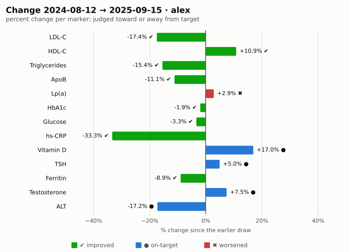
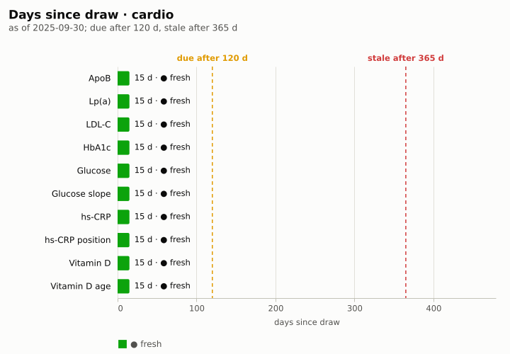

#+TITLE: Annual review · alex · 2025
#+SUBTITLE: 2024-10-01 – 2025-09-30
#+DATE: 2025-10-01
#+OPTIONS: toc:nil num:nil author:nil
#+STARTUP: showall

How the panel moved over 2024-10-01 – 2025-09-30, what changed since the year
before, and which tests are due.

* The year at a glance
#+BEGIN: health-chart :kind panel :person "alex" :since "2024-10-01" :until "2025-09-30" :caption "Every marker over the review period"
#+CAPTION: Every marker over the review period
#+ATTR_HTML: :alt Every marker over the review period
[[file:annual-review-assets/panel-alex-25c6b9fe.svg]]
#+END:

* Out-of-range map
#+BEGIN: health-chart :kind heatmap :person "alex" :until "2025-09-30" :caption "Each draw's status per marker; every cell carries its glyph"
#+CAPTION: Each draw's status per marker; every cell carries its glyph
#+ATTR_HTML: :alt Each draw's status per marker; every cell carries its glyph
[[file:annual-review-assets/heatmap-alex-5242f740.svg]]
#+END:

* Change since last year
#+BEGIN: health-chart :kind delta :person "alex" :baseline "2024-10-01" :until "2025-09-30" :caption "Percent change from the last draw before 2024-10-01 to the latest, judged toward target"
#+CAPTION: Percent change from the last draw before 2024-10-01 to the latest, judged toward target
#+ATTR_HTML: :alt Percent change from the last draw before 2024-10-01 to the latest, judged toward target

#+END:

* Cohort scorecards
** Cardiovascular
#+BEGIN: health-scorecard :person "alex" :cohort cardio :until "2025-09-30" :as-of "2025-09-30"
| Indicator | Value | Unit   |       Date | Status       | Trend      |
|-----------+-------+--------+------------+--------------+------------|
| ApoB      |    72 | mg/dL  | 2025-09-15 | ● optimal    | ↘ improved |
| Lp(a)     |   144 | nmol/L | 2025-09-15 | ▲ high       | ↗ worsened |
| LDL-C     |    76 | mg/dL  | 2025-09-15 | ◐ suboptimal | ↘ improved |
#+END:

** Metabolic
#+BEGIN: health-scorecard :person "alex" :cohort metabolic :until "2025-09-30" :as-of "2025-09-30"
| Indicator     | Value | Unit     |       Date | Status    | Trend      |
|---------------+-------+----------+------------+-----------+------------|
| HbA1c         |   5.3 | %        | 2025-09-15 | ● optimal | ↘ improved |
| Glucose       |    89 | mg/dL    | 2025-09-15 | ● optimal | ↘ improved |
| Glucose slope |  -4.3 | mg/dL/yr | 2025-09-15 | ? n/a     | ↘ falling  |
#+END:

** Inflammation
#+BEGIN: health-scorecard :person "alex" :cohort inflammation :until "2025-09-30" :as-of "2025-09-30"
| Indicator       | Value | Unit     |       Date | Status    | Trend      |
|-----------------+-------+----------+------------+-----------+------------|
| hs-CRP          |   0.8 | mg/L     | 2025-09-15 | ● optimal | ↘ improved |
| hs-CRP position | 0.267 | of range | 2025-09-15 | ○ normal  | ↘ improved |
#+END:

** Vitamins
#+BEGIN: health-scorecard :person "alex" :cohort vitamins :until "2025-09-30" :as-of "2025-09-30"
| Indicator     | Value | Unit  |       Date | Status    | Trend      |
|---------------+-------+-------+------------+-----------+------------|
| Vitamin D     |    55 | ng/mL | 2025-09-15 | ● optimal | ↗ improved |
| Vitamin D age |    15 | days  | 2025-09-15 | ○ normal  | –          |
#+END:

* Due tests
#+BEGIN: health-chart :kind staleness :person "alex" :cohort (cardio metabolic inflammation vitamins) :until "2025-09-30" :as-of "2025-09-30" :caption "Days since each indicator was drawn, against the due and stale thresholds"
#+CAPTION: Days since each indicator was drawn, against the due and stale thresholds
#+ATTR_HTML: :alt Days since each indicator was drawn, against the due and stale thresholds

#+END:

* Still out of range
#+BEGIN: health-flags :person "alex" :until "2025-09-30"
- ▲ high · *Lp(a)* 144 nmol/L (2025-09-15), reference 0–75
#+END:
