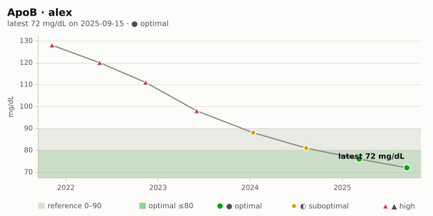
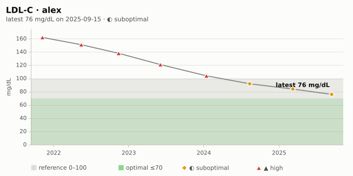
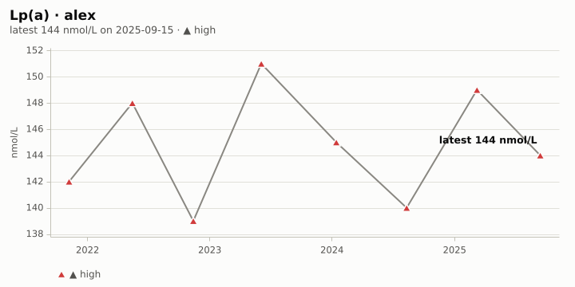
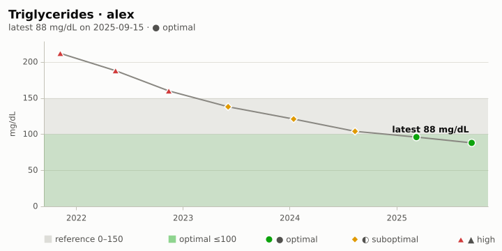
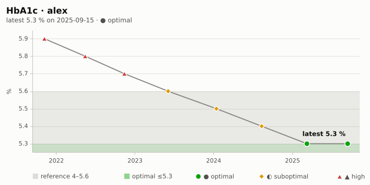
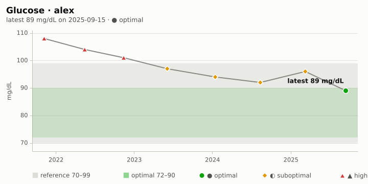
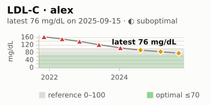
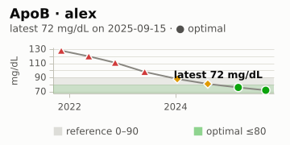
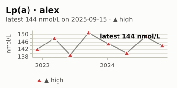

#+TITLE: Cardiometabolic report · alex
#+SUBTITLE: 2024-10-01 – 2025-09-30
#+DATE: 2025-10-01
#+OPTIONS: toc:nil num:nil author:nil
#+STARTUP: showall

The cardiovascular and metabolic cohorts as of 2025-09-30, with each
marker's history.

* Cardiovascular
#+BEGIN: health-scorecard :person "alex" :cohort cardio :until "2025-09-30" :as-of "2025-09-30"
| Indicator | Value | Unit   |       Date | Status       | Trend      |
|-----------+-------+--------+------------+--------------+------------|
| ApoB      |    72 | mg/dL  | 2025-09-15 | ● optimal    | ↘ improved |
| Lp(a)     |   144 | nmol/L | 2025-09-15 | ▲ high       | ↗ worsened |
| LDL-C     |    76 | mg/dL  | 2025-09-15 | ◐ suboptimal | ↘ improved |
#+END:

#+BEGIN: health-chart :kind timeseries :person "alex" :marker "apob" :until "2025-09-30" :caption "ApoB"
#+CAPTION: ApoB
#+ATTR_HTML: :alt ApoB

#+END:

#+BEGIN: health-chart :kind timeseries :person "alex" :marker "ldl-c" :until "2025-09-30" :caption "LDL-C"
#+CAPTION: LDL-C
#+ATTR_HTML: :alt LDL-C

#+END:

#+BEGIN: health-chart :kind timeseries :person "alex" :marker "lpa" :until "2025-09-30" :caption "Lp(a)"
#+CAPTION: Lp(a)
#+ATTR_HTML: :alt Lp(a)

#+END:

#+BEGIN: health-chart :kind timeseries :person "alex" :marker "triglycerides" :until "2025-09-30" :caption "Triglycerides"
#+CAPTION: Triglycerides
#+ATTR_HTML: :alt Triglycerides

#+END:

* Metabolic
#+BEGIN: health-scorecard :person "alex" :cohort metabolic :until "2025-09-30" :as-of "2025-09-30"
| Indicator     | Value | Unit     |       Date | Status    | Trend      |
|---------------+-------+----------+------------+-----------+------------|
| HbA1c         |   5.3 | %        | 2025-09-15 | ● optimal | ↘ improved |
| Glucose       |    89 | mg/dL    | 2025-09-15 | ● optimal | ↘ improved |
| Glucose slope |  -4.3 | mg/dL/yr | 2025-09-15 | ? n/a     | ↘ falling  |
#+END:

#+BEGIN: health-chart :kind timeseries :person "alex" :marker "hba1c" :until "2025-09-30" :caption "HbA1c"
#+CAPTION: HbA1c
#+ATTR_HTML: :alt HbA1c

#+END:

#+BEGIN: health-chart :kind timeseries :person "alex" :marker "glucose" :until "2025-09-30" :caption "Fasting glucose"
#+CAPTION: Fasting glucose
#+ATTR_HTML: :alt Fasting glucose

#+END:

* Genetics and labs
APOE and MTHFR calls next to the lipid and homocysteine markers commonly
read with them.

#+BEGIN: health-genetics-labs :person "alex" :kit "alex" :genes ("APOE" "MTHFR") :until "2025-09-30"
/Genotypes not shown: genetics.el is not loaded (genetics-kit and genetics-genotype are undefined); load it, or set =health-chart-genetics-functions=, and refresh this block./

*APOE* (rs429358, rs7412). APOE carries cholesterol in the blood; its ε2/ε3/ε4 alleles (rs429358, rs7412) are associated with differences in LDL-C and ApoB, so the lipid markers are often read alongside it. [[https://medlineplus.gov/genetics/gene/apoe/][MedlinePlus Genetics: APOE]]

- ◐ suboptimal · *LDL-C* 76 mg/dL (2025-09-15), reference 0–100
- ● optimal · *ApoB* 72 mg/dL (2025-09-15), reference 0–90
- ▲ high · *Lp(a)* 144 nmol/L (2025-09-15), reference 0–75
- *Total chol*: no results on file.

#+CAPTION: LDL-C
#+ATTR_HTML: :alt LDL-C

#+CAPTION: ApoB
#+ATTR_HTML: :alt ApoB

#+CAPTION: Lp(a)
#+ATTR_HTML: :alt Lp(a)

*MTHFR* (rs1801133, rs1801131). MTHFR helps process folate; the common C677T (rs1801133) and A1298C (rs1801131) variants lower enzyme activity and are associated with higher homocysteine when folate or B12 is low. [[https://medlineplus.gov/genetics/gene/mthfr/][MedlinePlus Genetics: MTHFR]]

- *Homocysteine*: no results on file.
- *Folate*: no results on file.
- *Vitamin B12*: no results on file.

/Informational only, not medical advice: these links show which lab markers are commonly read next to a gene; discuss results with a clinician./
#+END:

* Latest values
#+BEGIN: health-table :person "alex" :markers ("apob" "ldl-c" "hdl-c" "lpa" "triglycerides" "hba1c" "glucose") :until "2025-09-30"
#+PLOT: title:"Latest values · alex" ind:1 deps:(2) type:2d with:histograms set:"style fill solid 0.6" set:"xtics rotate by -45"
| Marker        | Value | Unit   |       Date | Status       | Reference | Optimal |
|---------------+-------+--------+------------+--------------+-----------+---------|
| LDL-C         |    76 | mg/dL  | 2025-09-15 | ◐ suboptimal | 0–100     | ≤70     |
| HDL-C         |    61 | mg/dL  | 2025-09-15 | ● optimal    | ≥40       | ≥60     |
| Triglycerides |    88 | mg/dL  | 2025-09-15 | ● optimal    | 0–150     | ≤100    |
| ApoB          |    72 | mg/dL  | 2025-09-15 | ● optimal    | 0–90      | ≤80     |
| Lp(a)         |   144 | nmol/L | 2025-09-15 | ▲ high       | 0–75      | ≤30     |
| HbA1c         |   5.3 | %      | 2025-09-15 | ● optimal    | 4–5.6     | ≤5.3    |
| Glucose       |    89 | mg/dL  | 2025-09-15 | ● optimal    | 70–99     | 72–90   |
#+END:
