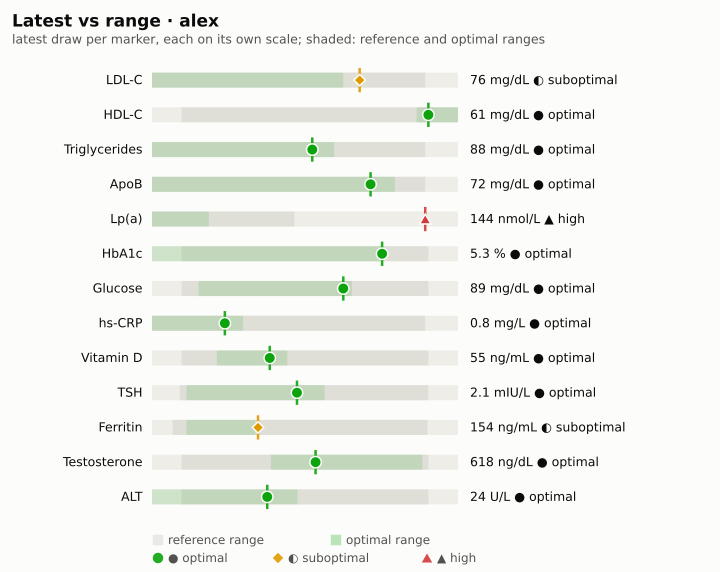
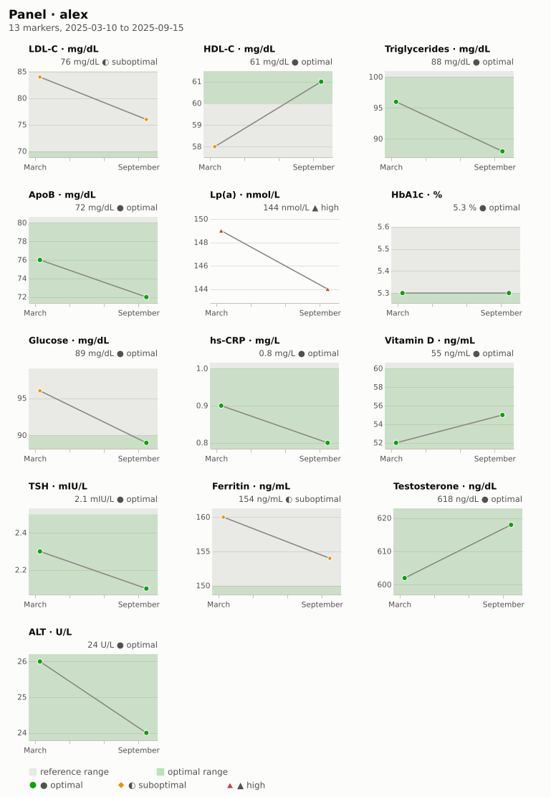
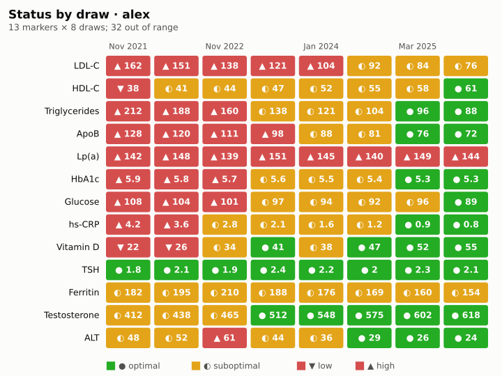
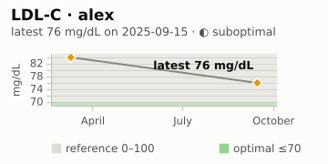
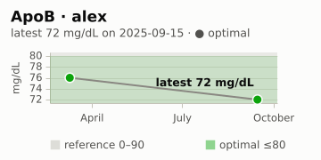
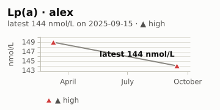
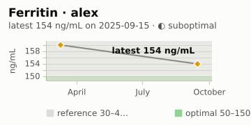

#+TITLE: Health report · alex · 2025
#+SUBTITLE: 2024-10-01 – 2025-09-30
#+DATE: 2025-10-01
#+OPTIONS: toc:2 num:nil author:nil
#+STARTUP: showall

Labs and genetics together: the latest draw, the year's trends, the
cohorts and, when genetics.el is loaded, the genetic summary and each
linked gene's call next to its lab markers.

* Labs
** Out of range
#+BEGIN: health-flags :person "alex" :until "2025-09-30"
- ▲ high · *Lp(a)* 144 nmol/L (2025-09-15), reference 0–75
#+END:

** Latest results
#+BEGIN: health-table :person "alex" :until "2025-09-30"
#+PLOT: title:"Latest values · alex" ind:1 deps:(2) type:2d with:histograms set:"style fill solid 0.6" set:"xtics rotate by -45"
| Marker        | Value | Unit   |       Date | Status       | Reference | Optimal |
|---------------+-------+--------+------------+--------------+-----------+---------|
| LDL-C         |    76 | mg/dL  | 2025-09-15 | ◐ suboptimal | 0–100     | ≤70     |
| HDL-C         |    61 | mg/dL  | 2025-09-15 | ● optimal    | ≥40       | ≥60     |
| Triglycerides |    88 | mg/dL  | 2025-09-15 | ● optimal    | 0–150     | ≤100    |
| ApoB          |    72 | mg/dL  | 2025-09-15 | ● optimal    | 0–90      | ≤80     |
| Lp(a)         |   144 | nmol/L | 2025-09-15 | ▲ high       | 0–75      | ≤30     |
| HbA1c         |   5.3 | %      | 2025-09-15 | ● optimal    | 4–5.6     | ≤5.3    |
| Glucose       |    89 | mg/dL  | 2025-09-15 | ● optimal    | 70–99     | 72–90   |
| hs-CRP        |   0.8 | mg/L   | 2025-09-15 | ● optimal    | 0–3       | ≤1      |
| Vitamin D     |    55 | ng/mL  | 2025-09-15 | ● optimal    | 30–100    | 40–60   |
| TSH           |   2.1 | mIU/L  | 2025-09-15 | ● optimal    | 0.4–4     | 0.5–2.5 |
| Ferritin      |   154 | ng/mL  | 2025-09-15 | ◐ suboptimal | 30–400    | 50–150  |
| Testosterone  |   618 | ng/dL  | 2025-09-15 | ● optimal    | 264–916   | 500–900 |
| ALT           |    24 | U/L    | 2025-09-15 | ● optimal    | 7–56      | ≤30     |
#+END:

#+BEGIN: health-chart :kind bullet :person "alex" :until "2025-09-30" :caption "Latest value per marker against its reference and optimal ranges"
#+CAPTION: Latest value per marker against its reference and optimal ranges
#+ATTR_HTML: :alt Latest value per marker against its reference and optimal ranges

#+END:

** Trends over 2024-10-01 – 2025-09-30
#+BEGIN: health-chart :kind panel :person "alex" :since "2024-10-01" :until "2025-09-30" :caption "Every marker over the period"
#+CAPTION: Every marker over the period
#+ATTR_HTML: :alt Every marker over the period

#+END:

#+BEGIN: health-chart :kind heatmap :person "alex" :until "2025-09-30" :caption "Each draw's status per marker"
#+CAPTION: Each draw's status per marker
#+ATTR_HTML: :alt Each draw's status per marker

#+END:

#+BEGIN: health-chart :kind delta :person "alex" :baseline "2024-10-01" :until "2025-09-30" :caption "Change since the last draw before 2024-10-01"
#+CAPTION: Change since the last draw before 2024-10-01
#+ATTR_HTML: :alt Change since the last draw before 2024-10-01
[[file:full-health-report-assets/delta-alex-b2c523aa.svg]]
#+END:

** Cohorts
#+BEGIN: health-scorecard :person "alex" :cohort (cardio metabolic inflammation vitamins) :until "2025-09-30" :as-of "2025-09-30"
| Indicator       | Value | Unit     |       Date | Status       | Trend      |
|-----------------+-------+----------+------------+--------------+------------|
| ApoB            |    72 | mg/dL    | 2025-09-15 | ● optimal    | ↘ improved |
| Lp(a)           |   144 | nmol/L   | 2025-09-15 | ▲ high       | ↗ worsened |
| LDL-C           |    76 | mg/dL    | 2025-09-15 | ◐ suboptimal | ↘ improved |
| HbA1c           |   5.3 | %        | 2025-09-15 | ● optimal    | ↘ improved |
| Glucose         |    89 | mg/dL    | 2025-09-15 | ● optimal    | ↘ improved |
| Glucose slope   |  -4.3 | mg/dL/yr | 2025-09-15 | ? n/a        | ↘ falling  |
| hs-CRP          |   0.8 | mg/L     | 2025-09-15 | ● optimal    | ↘ improved |
| hs-CRP position | 0.267 | of range | 2025-09-15 | ○ normal     | ↘ improved |
| Vitamin D       |    55 | ng/mL    | 2025-09-15 | ● optimal    | ↗ improved |
| Vitamin D age   |    15 | days     | 2025-09-15 | ○ normal     | –          |
#+END:

#+BEGIN: health-chart :kind staleness :person "alex" :cohort (cardio metabolic inflammation vitamins) :until "2025-09-30" :as-of "2025-09-30" :caption "Days since each indicator was drawn"
#+CAPTION: Days since each indicator was drawn
#+ATTR_HTML: :alt Days since each indicator was drawn
[[file:full-health-report-assets/staleness-alex-cardio-metabolic-inflammation-vitamins-6b2760f1.svg]]
#+END:

* Genetics
** Summary
#+BEGIN: health-genetics :section summary :kit "alex"
# genetics-summary failed: No genetics kit available: No loaded kit named "alex"
# What to do: Load the kit with M-x genetics-open, or give the block :file "path/to/kit" (or :kit with a loaded kit's name).

/Informational only, not medical advice./ Consumer genotyping and sequencing are not diagnostic; confirm any finding with a clinical-grade test and a clinician.
#+END:

** APOE
#+BEGIN: health-genetics :section apoe :kit "alex"
# genetics-apoe failed: No genetics kit available: No loaded kit named "alex"
# What to do: Load the kit with M-x genetics-open, or give the block :file "path/to/kit" (or :kit with a loaded kit's name).

/Informational only, not medical advice./ Consumer genotyping and sequencing are not diagnostic; confirm any finding with a clinical-grade test and a clinician.
#+END:

* Genetics and labs
Each linked gene's call next to the lab markers commonly read with it.

#+BEGIN: health-genetics-labs :person "alex" :kit "alex" :since "2024-10-01" :until "2025-09-30"
/Genotypes not shown: genetics.el is not loaded (genetics-kit and genetics-genotype are undefined); load it, or set =health-chart-genetics-functions=, and refresh this block./

*APOE* (rs429358, rs7412). APOE carries cholesterol in the blood; its ε2/ε3/ε4 alleles (rs429358, rs7412) are associated with differences in LDL-C and ApoB, so the lipid markers are often read alongside it. [[https://medlineplus.gov/genetics/gene/apoe/][MedlinePlus Genetics: APOE]]

- ◐ suboptimal · *LDL-C* 76 mg/dL (2025-09-15), reference 0–100
- ● optimal · *ApoB* 72 mg/dL (2025-09-15), reference 0–90
- ▲ high · *Lp(a)* 144 nmol/L (2025-09-15), reference 0–75
- *Total chol*: no results on file.

#+CAPTION: LDL-C
#+ATTR_HTML: :alt LDL-C

#+CAPTION: ApoB
#+ATTR_HTML: :alt ApoB

#+CAPTION: Lp(a)
#+ATTR_HTML: :alt Lp(a)

*MTHFR* (rs1801133, rs1801131). MTHFR helps process folate; the common C677T (rs1801133) and A1298C (rs1801131) variants lower enzyme activity and are associated with higher homocysteine when folate or B12 is low. [[https://medlineplus.gov/genetics/gene/mthfr/][MedlinePlus Genetics: MTHFR]]

- *Homocysteine*: no results on file.
- *Folate*: no results on file.
- *Vitamin B12*: no results on file.

*HFE* (rs1800562, rs1799945). HFE helps regulate iron uptake; C282Y (rs1800562) and H63D (rs1799945) are associated with higher iron stores, which ferritin, serum iron and transferrin saturation describe. [[https://medlineplus.gov/genetics/gene/hfe/][MedlinePlus Genetics: HFE]]

- ◐ suboptimal · *Ferritin* 154 ng/mL (2025-09-15), reference 30–400
- *Iron*: no results on file.
- *Transferrin sat.*: no results on file.

#+CAPTION: Ferritin
#+ATTR_HTML: :alt Ferritin

*LCT* (rs4988235). rs4988235, upstream of LCT, is associated with lactase persistence into adulthood. Relevant to dietary lactose tolerance only; no standard lab marker is linked. [[https://medlineplus.gov/genetics/condition/lactose-intolerance/][MedlinePlus Genetics: lactose intolerance]]

*F5* (rs6025). rs6025 is factor V Leiden, associated with a higher tendency to form blood clots. No marker in standard lab panels reflects it; it is read from genetic or coagulation testing. [[https://medlineplus.gov/genetics/gene/f5/][MedlinePlus Genetics: F5]]

*CYP2C19* (rs4244285). rs4244285 (CYP2C19*2) is associated with reduced metabolism of some medicines, such as clopidogrel. Pharmacogenomic: it bears on how some medicines are processed, with no lab marker. [[https://medlineplus.gov/genetics/gene/cyp2c19/][MedlinePlus Genetics: CYP2C19]]

/Informational only, not medical advice: these links show which lab markers are commonly read next to a gene; discuss results with a clinician./
#+END:
