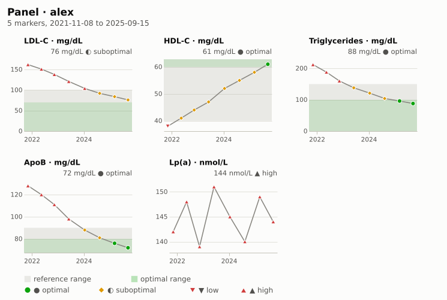
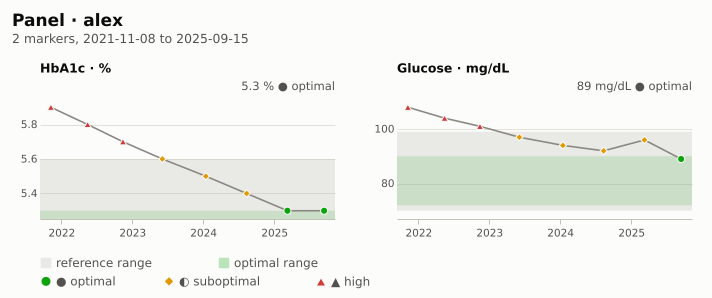
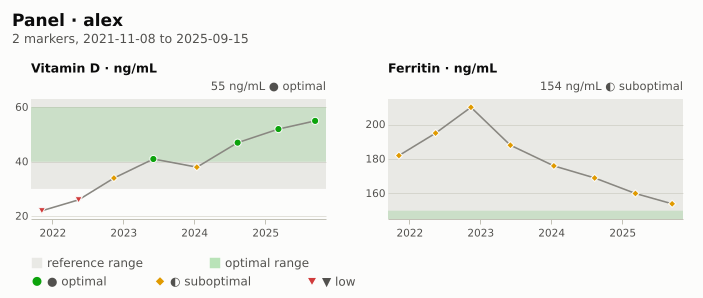
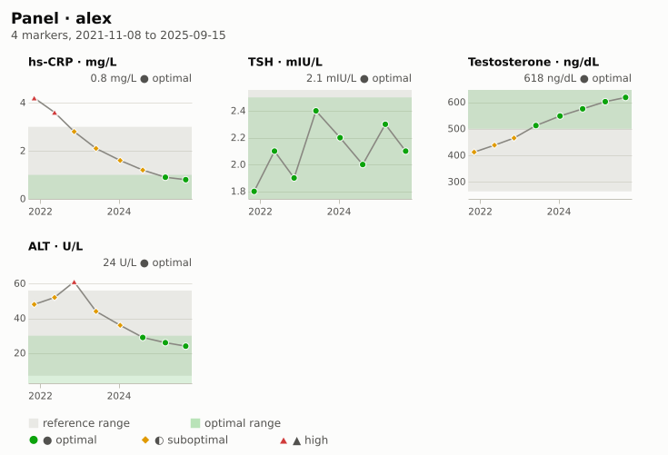

#+TITLE: Lab draw · alex · 2025-09-30
#+SUBTITLE: Latest results as of 2025-09-30
#+DATE: 2025-10-01
#+OPTIONS: toc:nil num:nil author:nil
#+STARTUP: showall

Results of the draw on or before 2025-09-30, with each marker's history
for context.  Refresh every block with =M-x health-chart-org-update=.

* Out of range
#+BEGIN: health-flags :person "alex" :until "2025-09-30"
- ▲ high · *Lp(a)* 144 nmol/L (2025-09-15), reference 0–75
#+END:

* Results
#+BEGIN: health-table :person "alex" :until "2025-09-30"
#+PLOT: title:"Latest values · alex" ind:1 deps:(2) type:2d with:histograms set:"style fill solid 0.6" set:"xtics rotate by -45"
| Marker        | Value | Unit   |       Date | Status       | Reference | Optimal |
|---------------+-------+--------+------------+--------------+-----------+---------|
| LDL-C         |    76 | mg/dL  | 2025-09-15 | ◐ suboptimal | 0–100     | ≤70     |
| HDL-C         |    61 | mg/dL  | 2025-09-15 | ● optimal    | ≥40       | ≥60     |
| Triglycerides |    88 | mg/dL  | 2025-09-15 | ● optimal    | 0–150     | ≤100    |
| ApoB          |    72 | mg/dL  | 2025-09-15 | ● optimal    | 0–90      | ≤80     |
| Lp(a)         |   144 | nmol/L | 2025-09-15 | ▲ high       | 0–75      | ≤30     |
| HbA1c         |   5.3 | %      | 2025-09-15 | ● optimal    | 4–5.6     | ≤5.3    |
| Glucose       |    89 | mg/dL  | 2025-09-15 | ● optimal    | 70–99     | 72–90   |
| hs-CRP        |   0.8 | mg/L   | 2025-09-15 | ● optimal    | 0–3       | ≤1      |
| Vitamin D     |    55 | ng/mL  | 2025-09-15 | ● optimal    | 30–100    | 40–60   |
| TSH           |   2.1 | mIU/L  | 2025-09-15 | ● optimal    | 0.4–4     | 0.5–2.5 |
| Ferritin      |   154 | ng/mL  | 2025-09-15 | ◐ suboptimal | 30–400    | 50–150  |
| Testosterone  |   618 | ng/dL  | 2025-09-15 | ● optimal    | 264–916   | 500–900 |
| ALT           |    24 | U/L    | 2025-09-15 | ● optimal    | 7–56      | ≤30     |
#+END:

* Where each value sits in its ranges
#+BEGIN: health-chart :kind bullet :person "alex" :until "2025-09-30" :caption "Latest value per marker against its reference (light) and optimal (dark) ranges"
#+CAPTION: Latest value per marker against its reference (light) and optimal (dark) ranges
#+ATTR_HTML: :alt Latest value per marker against its reference (light) and optimal (dark) ranges
[[file:lab-draw-assets/bullet-alex-6464d203.svg]]
#+END:

* By category
** Lipids
#+BEGIN: health-chart :kind panel :person "alex" :category "lipids" :until "2025-09-30" :caption "Lipid markers over time"
#+CAPTION: Lipid markers over time
#+ATTR_HTML: :alt Lipid markers over time

#+END:

** Metabolic
#+BEGIN: health-chart :kind panel :person "alex" :category "metabolic" :until "2025-09-30" :caption "Glycemic markers over time"
#+CAPTION: Glycemic markers over time
#+ATTR_HTML: :alt Glycemic markers over time

#+END:

** Vitamins and minerals
#+BEGIN: health-chart :kind panel :person "alex" :category "vitamins" :until "2025-09-30" :caption "Vitamin D and ferritin over time"
#+CAPTION: Vitamin D and ferritin over time
#+ATTR_HTML: :alt Vitamin D and ferritin over time

#+END:

** Inflammation, thyroid, liver and hormones
#+BEGIN: health-chart :kind panel :person "alex" :markers ("hscrp" "tsh" "alt" "testosterone-total") :until "2025-09-30" :caption "Other markers over time"
#+CAPTION: Other markers over time
#+ATTR_HTML: :alt Other markers over time

#+END:
